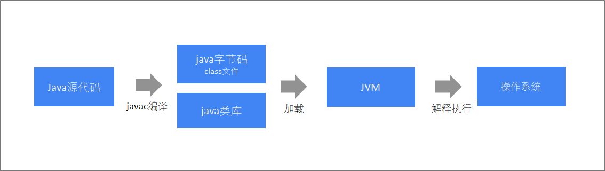

# Scala第一章节

### 章节目标

1. 理解Scala的相关概述
2. 掌握Scala的环境搭建
3. 掌握Scala小案例: 做最好的自己

***

### 1. Scala简介

#### 1.1 概述

​	Scala(斯嘎拉)这个名字来源于"Scalable Language(可伸缩的语言)", 它是一门基于JVM的多范式编程语言, 通俗的说: **Scala是一种运行在JVM上的函数式的面向对象语言**. 之所以这样命名, 是因为它的设计目标是: 随着用户的需求一起成长. Scala可被广泛应用于各种编程任务, 从编写小型的脚本到构建巨型系统, 它都能胜任. 正因如此, Scala得以提供一些出众的特性, 例如: **它集成了面向对象编程和面向函数式编程的各种特性, 以及更高层的并发模型**. 

​	总而言之,  Scala融汇了许多前所未有的特性, 而同时又运行于JVM之上, 随着开发者对Scala的兴趣日增, 以及越来越多的工具支持, 无疑Scala语言将成为你手上一门必不可少的工具. 

​	`基于JVM解释:Scala的运行环境和Java类似, 也是依赖JVM的.`

​	`多范式解释: Scala支持多种编程风格。比如面向对象，也支持面向函数`

`大数据高并发支持比JAVA还好`

#### 1.2 Scala之父

​	**Scala之父是: Martin·Odersky(马丁·奥德斯基)**,  他是EPFL（瑞士领先的技术大学）编程研究组的教授. 也是Typesafe公司(现已更名为: Lightbend公司)的联合创始人. **他在整个职业生涯中一直不断追求着一个目标：让写程序这样一个基础工作变得高效、简单、且令人愉悦**. 他曾经就职于IBM研究院、耶鲁大学、卡尔斯鲁厄大学以及南澳大利亚大学. 在此之前，他在瑞士苏黎世联邦理工学院追随Pascal语言创始人Niklaus Wirth(1984年图灵奖获得者)学习，并于1989年获得博士学位. 

#### 1.3 语言特点

 * Scala是兼容的

   ```兼容Java，可以访问庞大的Java类库，例如：操作mysql、redis、freemarker、activemq等等```

 * Scala是精简的

   ```Scala表达能力强，一行代码抵得上多行Java代码，开发速度快```

 * Scala是高级的

   ```Scala可以让你的程序保持短小, 清晰, 看起来更简洁, 更优雅```

 * Scala是静态类型的

   ```Scala拥有非常先进的静态类型系统, 支持: 类型推断和模式匹配等。类似JAVA的static```

 * Scala可以开发大数据应用程序

   ```例如: Spark程序、Flink程序等等...```

### 2. Scala程序和Java程序对比

#### 2.1 程序的执行流程对比

**Java程序编译执行流程**



编译器：javac
加载：类加载器

**Scala程序编译执行流程**


编译器：scalac

#### 2.2 代码对比

**需求: **

​	定义一个学生类,  属性为: 姓名和年龄, 然后在测试类中创建对象并测试.

**Java代码**

```java
//定义学生类
public class Student{
    private String name;		//姓名
    private int age;			//年龄
    
    //空参和全参构造
    public Student(){}
    
    public Student(String name, int age){
        this.name = name;
        this.age = age;
    }
    
    //getXxx()和setXxx()方法
    //getter, setter方法
    public String getName() {
        return name;
    }
    public void setName(String name) {
        this.name = name;
    }
    public int getAge() {
        return age;
    }
    public void setAge(int age) {
        this.age = age;
    }
}

//测试类
public class StudentDemo {
     public static void main(String[] args) {
        Student s1 = new Student("张三", 23);	//创建Student类型的对象s1, 并赋值
        System.out.println(s1);				 //打印对象, 查看结果.
    }
}
```

**Scala代码**

安装scala的SDK后，在cmd中运行scala
```Scala
case class Student(var name:String, var age:Int)		//定义一个Student类
val s1 = Student("张三", 23)				 //创建Student类型的对象s1, 并赋值
println(s1)								//打印对象, 查看结果.
```


### 3. Scala环境搭建

#### 3.1 概述

scala程序运行需要依赖于Java类库，那么必须要有**Java运行环境**，scala才能正确执行. 所以要编译运行scala程序，需要: 

- JDK（JDK包含JVM）
- Scala编译器（Scala SDK）   

接下来，需要依次安装以下内容：

- 安装JDK
- 安装Scala SDK
- 在IDEA中安装Scala插件

#### 3.2 安装JDK

安装JDK 1.8 64位版本，并配置好环境变量, 此过程略.

#### 3.3 安装Scala SDK

Scala SDK是scala语言的编译器，要开发scala程序，必须要先安装Scala SDK
安装的版本是: 2.13.3
使用开发工具: vscode


### 4. Scala解释器

#### 4.1 概述

​scala解释器像Linux命令一样，执行一条代码，马上就可以让我们看到执行结果，用来测试比较方便。

#### 4.2 启动scala解释器

要启动scala解释器，只需要以下几步：

- 按住`windows键 + r`
- 输入`scala`即可

#### 4.3 执行scala代码

在scala的命令提示窗口中输入`println("hello, world")`，回车执行.

#### 4.4 退出解释器

**方式一:  点击右上角的"×"**

**方式二: 输入`:quit`退出**


### 5. 案例: 做最好的自己.

#### 5.1 需求

​	提示用户录入他/她最想对自己说的一句话, 然后将这句话打印到控制台上.

#### 5.2 目的

​	测试Scala和Java之间可以无缝互调(`即: Scala兼容Java，可以访问庞大的Java类库`).

#### 5.3 思路分析

 	1. 因为涉及到键盘录入了, 所以先导包.
 	2. 提示用户录入他/她最想对自己说的一句话.
 	3. 接收用户录入的内容, 并打印.

#### 5.4 参考代码

```scala
//1. 导入Java中的Scanner类. 引入Java类库
import java.util.Scanner
//2. 提示用户录入他/她最想对自己说的一句话.Scala代码
println("请录入一句您最想对自己说的一句话: ")
//3. 打印用户录入的内容. Scala代码 + Java类库
//不忘初心, 方得始终, 做最好的自己!
println("我最想对自己说: " + new Scanner(System.in).nextLine())
```

#### 5.5 小彩蛋

其实Scala中也有自己独有的`接收用户键盘录入数据`的功能, 远比上边的写法要简单的多, 要优雅的多. 