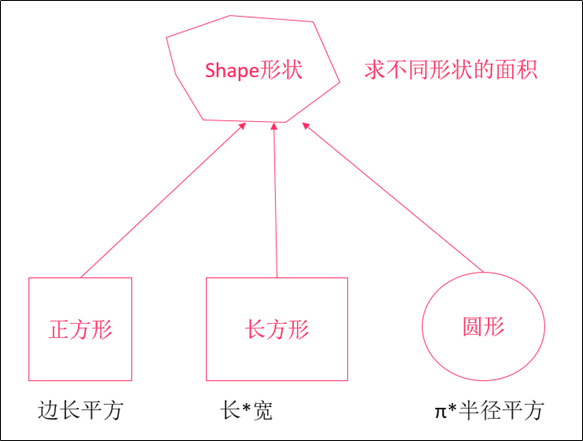

#  Scala第七章节

### 章节目标

1. 掌握继承和抽象类相关知识点
2. 掌握匿名内部类的用法
3. 了解类型转换的内容
4. 掌握动物类案例

------

### 1. 继承

#### 1.1 概述

实际开发中, 我们发现好多类中的内容是相似的(例如: 相似的属性和行为), 每次写很麻烦. 于是我们可以把这些相似的内容提取出来单独的放到一个类中(父类), 然后让那多个类(子类)和这个类(父类)产生一个关系, 从而实现子类可以访问父类的内容, 这个关系就叫: 继承.

因为scala语言是支持面向对象编程的，我们也可以使用scala来实现继承，通过继承来减少重复代码。

#### 1.2 语法

- scala中使用**extends**关键字来实现继承
- 可以在子类中定义父类中没有的字段和方法，或者重写父类的方法
- 类和单例对象都可以有父类

**语法**

```scala
class/object A类 extends B类 {	
    ..
}
```

**叫法**

* 上述格式中, A类称之为: 子类, 派生类.
* B类称之为: 父类, 超类, 基类.

#### 1.3 类继承

**需求**

已知学生类(Student)和老师类(Teacher), 他们都有姓名和年龄(属性), 都要吃饭(行为), 请用所学, 模拟该需求. 

* 方式一:  非继承版.

```scala
object ClassDemo01 {
  //1. 定义老师类.
  class Teacher{
    var name = ""
    var age = 0

    def eat() = println("老师喝牛肉汤!...")
  }
  //2. 定义学生类.
  class Student{
    var name = ""
    var age = 0

    def eat() = println("学生吃牛肉!...")
  }

  //main方法, 程序的主入口
  def main(args: Array[String]): Unit = {
    //3. 测试老师类.
    //3.1 创建对象.
    val t = new Teacher
    //3.2 给属性赋值
    t.name = "刘老师"
    t.age = 32
    //3.3 打印属性值.
    println(t.name, t.age)
    //3.4 调用方法
    t.eat()
    println("-" * 15)

    //4. 测试学生类.
    val s = new Student
    s.name = "张三"
    s.age = 21
    println(s.name, s.age)
    s.eat()
  }
}
```

* 方式二: 继承版

```scala
object ClassDemo02 {
  //1. 定义人类.
  class Person {
    var name = ""
    var age = 0

    def eat() = println("人要吃饭!...")
  }
  //2. 定义老师类.
  class Teacher extends Person
  //3. 定义学生类.
  class Student extends Person

  def main(args: Array[String]): Unit = {
    //4. 测试老师类.
    val t = new Teacher
    t.name = "刘老师"
    t.age = 32
    println(t.name, t.age)
    t.eat()
    println("-" * 15)
    //5. 测试学生类.
    val s = new Student
    s.name = "张三"
    s.age = 23
    println(s.name, s.age)
    s.eat()
  }
}
```

#### 1.4 单例对象继承

在Scala中, 单例对象也是可以继承类的. 也就是可以用object继承class。

**需求**

定义Person类(成员变量: 姓名, 成员方法: sayHello()), 定义单例对象Student继承自Person, 然后测试.

```scala
object ClassDemo03 {
  //1. 定义Person类.
  class Person {
    var name = ""

    def sayHello() = println("Hello, Scala!..")
  }
  //2. 定义单例对象Student, 继承Person.
  object Student extends Person

  //main方法, 程序的主入口
  def main(args: Array[String]): Unit = {
    //3. 测试Student中的成员.
    Student.name = "张三"
    println(Student.name)
    Student.sayHello()
  }
}
```

#### 1.5 方法重写

##### 1.5.1 概述

子类中出现和父类一模一样的方法时, 称为方法重写. Scala代码中可以在子类中使用override来重写父类的成员，也可以使用super来引用父类的成员.

##### 1.5.2 注意事项

- 子类要重写父类中的某一个方法，该方法必须要使用override关键字来修饰

- 可以使用override来重写一个val字段.

  > 注意: 父类用var修饰的变量, 子类不能重写.

- 使用super关键字来访问父类的成员方法

##### 1.5.3 示例

**需求**

定义Person类, 属性(姓名, 年龄), 有一个sayHello()方法.

然后定义Student类继承Person类, 重写Person类中的字段和方法, 并测试.

**参考代码**

```scala
object ClassDemo04 {
  //1. 定义父类Person.
  class Person {
    var name = "张三"
    val age = 23

    def sayHello() = println("Hello, Person!...")
  }
  //2. 定义子类Student, 继承Person.
  class Student extends Person{
    //override var name = "李四"    //这样写会报错, 子类不能重写父类用var修饰的变量.
    override val age = 24

    override def sayHello() = {
      //通过super调用父类的成员.
      super.sayHello()
      println("Hello, Student!...")
    }
  }
  //程序的入口.
  def main(args: Array[String]): Unit = {
    //3. 创建学生类型的对象, 然后测试.
    val s = new Student
    println(s.name, s.age)
    s.sayHello()
  }
}
```


### 2. 类型判断

有时候，我们设计的程序，要根据变量的类型来执行对应的逻辑, 如下图: 


在scala中，如何来进行类型判断呢？

有两种方式：

- isInstanceOf
- getClass/classOf

#### 2.1 isInstanceOf, asInstanceOf

**概述**

- isInstanceOf:  判断对象是否为指定类的对象
- asInstanceOf: 将对象转换为指定类型

**格式**

```scala
// 判断对象是否为指定类型
val trueOrFalse:Boolean = 对象.isInstanceOf[类型]

// 将对象转换为指定类型
val 变量 = 对象.asInstanceOf[类型]
```

> 示例代码:
>
> ​	val trueOrFalse = p.isInstanceOf[Student]
>
> ​	val s = p.asInstanceOf[Student]

#### 2.2 案例

**需求**

- 定义一个Person类
- 定义一个Student类继承自Person类, 该类有一个sayHello()方法.
- 创建一个Student类对象, 并指定它的类型为Person类型
- 判断该对象是否为Student类型，如果是，将其转换为Student类型并调用sayHello()方法.

**参考代码**

```scala
object ClassDemo05 {
  //1. 定义一个Person类.
  class Person

  //2. 定义一个Student类, 继承Person.
  class Student extends Person {
    def sayHello() = println("Hello, Scala!...")
  }

  //main方法, 作为程序的主入口
  def main(args: Array[String]): Unit = {
    //3. 通过多态的形式创建Student类型的对象.
    val p: Person = new Student
    //s.sayHello()      //这样写会报错, 因为多态的弊端是: 父类引用不能直接访问子类的特有成员.
    //4. 判断其是否是Student类型的对象, 如果是, 将其转成Student类型的对象.
    if (p.isInstanceOf[Student]) {
      val s = p.asInstanceOf[Student]
      //5. 调用Student#sayHello()方法
      s.sayHello()
    }
  }
}
```

#### 2.3 getClass和classOf

isInstanceOf 只能判断对象是否为**指定类以及其子类**的对象，而不能精确的判断出: 对象就是指定类的对象。如果要求精确地判断出对象的类型就是指定的数据类型，那么就只能使用 getClass 和 classOf 来实现.

**用法**

- p.getClass可以精确获取对象的类型
- classOf[类名]可以精确获取数据类型
- 使用==操作符可以直接比较类型

**示例**

**示例说明**

- 定义一个Person类
- 定义一个Student类继承自Person类
- 创建一个Student类对象，并指定它的类型为Person类型
- 测试使用isInstance判断该对象是否为Person类型
- 测试使用getClass/classOf判断该对象是否为Person类型
- 测试使用getClass/classOf判断该对象是否为Student类型

**参考代码**

```scala
object ClassDemo06 {
  //1. 定义一个Person类.
  class Person
  //2. 定义一个Student类, 继承自Person类.
  class Student extends Person

  def main(args: Array[String]): Unit = {
    //3. 创建Student类型的对象, 指定其类型为Person.
    val p:Person = new Student
    //4. 通过isInstanceOf关键字判断其是否是Person类型的对象.
    println(p.isInstanceOf[Person])       	//true, 
    //5. 通过isInstanceOf关键字判断其是否是Person类型的对象.
    println(p.isInstanceOf[Student])     	//true
    //6. 通过getClass, ClassOf判断其是否是Person类型的对象.
    println(p.getClass == classOf[Person])    //false
    //7. 通过getClass, ClassOf判断其是否是Student类型的对象.
    println(p.getClass == classOf[Student])   //true
  }
}

```


### 3. 抽象类

scala语言是支持抽象类的, , 通过abstract关键字来实现.

#### 3.1 定义

如果类中有抽象字段或者抽象方法, 那么该类就应该是一个**抽象类.**

> * 抽象字段:  没有初始化值的变量就是抽象字段.
> * 抽象方法:   没有方法体的方法就是一个抽象方法.

#### 3.2 格式

```scala
// 定义抽象类
abstract class 抽象类名 {
  // 定义抽象字段
  val/var 抽象字段名:类型
  // 定义抽象方法
  def 方法名(参数:参数类型,参数:参数类型...):返回类型
}
```

#### 3.3 抽象方法案例

**需求**



- 设计4个类，表示上述图中的继承关系
- 每一个形状都有自己求面积的方法，但是不同的形状计算面积的方法不同

**步骤**

1. 创建一个Shape抽象类，添加一个area抽象方法，用于计算面积
2. 创建一个Square正方形类，继承自Shape，它有一个边长的主构造器，并实现计算面积方法
3. 创建一个长方形类，继承自Shape，它有一个长、宽的主构造器，实现计算面积方法
4. 创建一个圆形类，继承自Shape，它有一个半径的主构造器，并实现计算面积方法
5. 编写main方法，分别创建正方形、长方形、圆形对象，并打印它们的面积

**参考代码**

```scala
// 创建形状抽象类
abstract class Shape {
  def area:Double
}

// 创建正方形类
class Square(var edge:Double /*边长*/) extends Shape {
  // 实现父类计算面积的方法
  override def area: Double = edge * edge
}

// 创建长方形类
class Rectangle(var length:Double /*长*/, var width:Double /*宽*/) extends Shape {
  override def area: Double = length * width
}

// 创建圆形类
class Circle(var radius:Double /*半径*/) extends Shape {
  override def area: Double = Math.PI * radius * radius
}

object ClassDemo07 {
  def main(args: Array[String]): Unit = {
    val s1:Shape = new Square(2)
    val s2:Shape = new Rectangle(2,3)
    val s3:Shape = new Circle(2)

    println(s1.area)
    println(s2.area)
    println(s3.area)
  }
}
```

#### 3.4 抽象字段

在scala的抽象类中，不仅可以定义抽象方法, 也可以定义抽象字段。如果一个成员变量是没有初始化，我们就认为它是抽象的。

**语法**

```scala
abstract class 抽象类 {
    val/var 抽象字段:类型
}
```

**示例**

**示例说明**

1. 创建一个Person抽象类，它有一个String抽象字段occupation
2. 创建一个Student类，继承自Person类，重写occupation字段，初始化为学生
3. 创建一个Teacher类，继承自Person类，重写occupation字段，初始化为老师
4. 添加main方法，分别创建Student/Teacher的实例，然后分别打印occupation


**参考代码**

```scala
object ClassDemo08 {
  //1. 定义抽象类Person, 有一个抽象字段occupation(职业)
  abstract class Person {
    val occupation:String
  }
  //2. 定义Student类继承Person, 重写抽象字段occupation.
  class Student extends Person{
    override val occupation: String = "学生"
  }
  //3. 定义Teacher类继承Person, 重写抽象字段occupation.
  class Teacher extends Person{
    override val occupation: String = "老师"
  }
  //main方法, 作为程序的主入口
  def main(args: Array[String]): Unit = {
    //4. 创建Student类的对象, 打印occupation的值.
    val s = new Student
    println(s.occupation)
    //5. 创建Teacher类的对象, 打印occupation的值.
    val t = new Teacher
    println(t.occupation)
  }
}
```


### 4. 匿名内部类

匿名内部类是继承了类的匿名的子类对象，它可以直接用来创建实例对象。Spark的源代码中大量使用到匿名内部类。学完这个内容, 对我们查看Spark的底层源码非常有帮助.

#### 4.1 语法

```scala
new 类名() {
    //重写类中所有的抽象内容
}
```

> 注意: 上述格式中, 如果的类的主构造器参数列表为空, 则小括号可以省略不写.

#### 4.2 使用场景

* 当对对象方法(成员方法)仅调用一次的时候.
* 可以作为方法的参数进行传递.

#### 4.3 示例

**需求**

1. 创建一个Person抽象类，并添加一个sayHello抽象方法
2. 定义一个show()方法, 该方法需要传入一个Person类型的对象, 然后调用Person类中的sayHello()方法.
3. 添加main方法，通过匿名内部类的方式来创建Person类的子类对象, 调用Person类的sayHello()方法.
4. 调用show()方法.

**参考代码**

```scala
object ClassDemo09 {
  //1. 定义Person类, 里边有一个抽象方法: sayHello()
  abstract class Person{
    def sayHello()
  }

  //2. 定义一个show()方法, 该方法需要传入一个Person类型的对象.
  def show(p:Person) = p.sayHello()

  //main方法是程序的主入口
  def main(args: Array[String]): Unit = {
    //3. 通过匿名内部类创建Person的子类对象, 并调用sayHello()方法.
    new Person {
      override def sayHello(): Unit = println("Hello, Scala, 当对成员方法仅调用一次的时候.")
    }.sayHello()

    //4. 演示: 匿名内部类可以作为方法的参数进行传递.
    val p = new Person {
      override def sayHello(): Unit = println("Hello, Scala, 可以作为方法的实际参数进行传递")
    }
    show(p)
  }
}
```


### 5. 案例: 动物类

#### 5.1 需求

已知有猫类和狗类, 它们都有姓名和年龄, 都会跑步, 而且仅仅是跑步, 没有什么不同. 它们都有吃饭的功能, 不同的是猫吃鱼, 狗吃肉. 而且猫类独有自己的抓老鼠功能, 狗类独有自己的看家功能, 请用所学模拟该需求.

#### 5.2 目的

- 考察`继承, 抽象类, 类型转换`这些知识点.

#### 5.3 步骤

1. 定义抽象动物类(Animal), 属性: 姓名, 年龄, 行为: 跑步, 吃饭.
2. 定义猫类(Cat)继承自动物类, 重写吃饭的方法, 并定义该类独有的抓老鼠的方法.
3. 定义狗类(Dog)继承自动物类, 重写吃饭的方法, 并定义该类独有的看家的方法.

#### 5.4 参考代码

```scala
object ClassDemo10 {
  //1. 定义抽象动物类(Animal), 属性: 姓名, 年龄, 行为: 跑步, 吃饭.
  abstract class Animal{
    //1.1 属性
    var name = ""
    var age = 0

    //1.2 行为
    def run() = println("动物会跑步!...")
    //吃饭的方法.
    def eat():Unit
  }
  //2. 定义猫类(Cat)继承自动物类, 重写吃饭的方法, 并定义该类独有的抓老鼠的方法.
  class Cat extends Animal {
    //2.1 重写父类的抽象方法
    override def eat(): Unit = println("猫吃鱼")
    //2.2 定义自己的独有方法
    def catchMouse() = println("猫会抓老鼠")
  }
  //3. 定义狗类(Dog)继承自动物类, 重写吃饭的方法, 并定义该类独有的看家的方法.
  class Dog extends Animal {
    //3.1 重写父类的抽象方法
    override def eat(): Unit = println("狗吃肉")
    //3.2 定义自己的独有方法
    def lookHome() = println("狗会看家")
  }

  //main方法, 作为程序的入口
  def main(args: Array[String]): Unit = {
    //4. 测试猫类.
    //4.1 创建猫类对象.
    val c = new Cat
    //4.2 给成员变量赋值.
    c.name = "汤姆"
    c.age = 13
    //4.3 打印成员变量值
    println(c.name, c.age)
    //4.4 调用方法.
    c.eat()
    //4.5 调用猫类的独有功能: 抓老鼠
    if (c.isInstanceOf[Cat]) {
      val cat = c.asInstanceOf[Cat]
      cat.catchMouse()
    } else if(c.isInstanceOf[Dog]) {
      val dog = c.asInstanceOf[Dog]
      dog.lookHome()
    } else{
      println("您传入的不是猫类, 也不是狗类对象")
    }

    //5. 测试狗类, 自己完成.
  }
}
```


