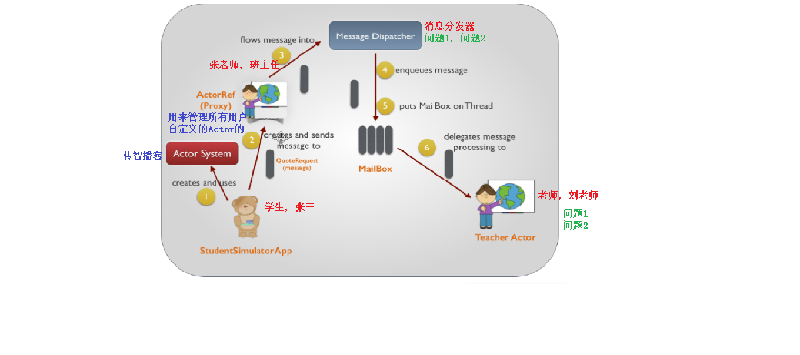
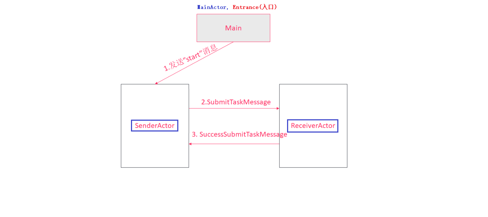
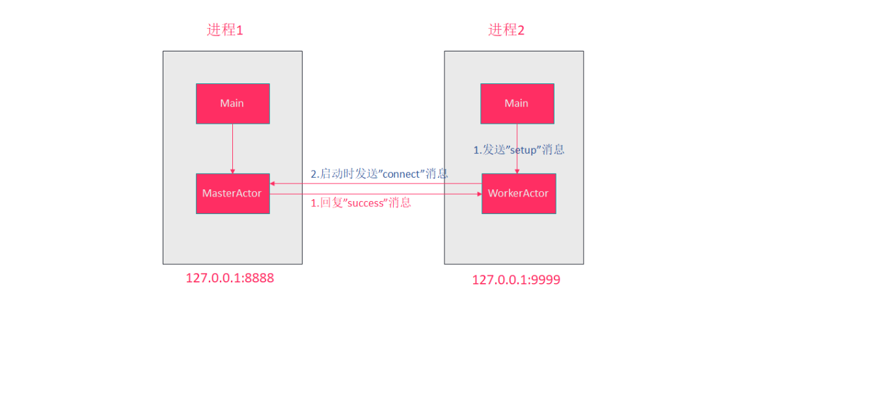
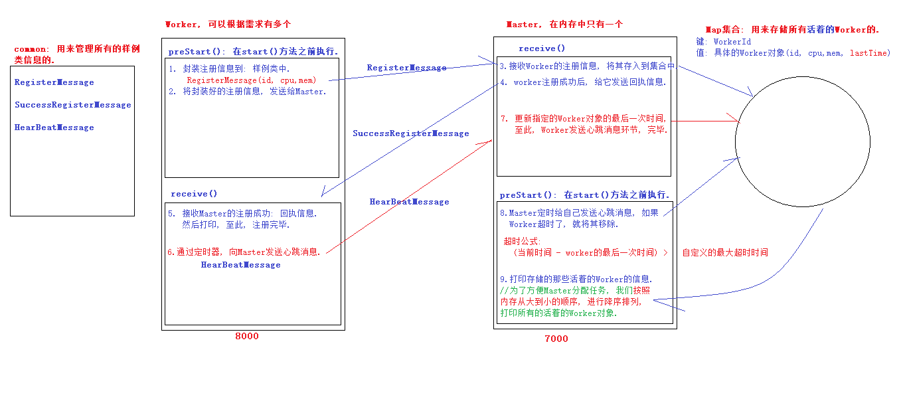

# Scala第二十章节

### 章节目标

1. 理解Akka并发编程框架简介
2. 掌握Akka入门案例
3. 掌握Akka定时任务代码实现
4. 掌握两个进程间通信的案例
5. 掌握简易版spark通信框架案例

------

### 1. Akka并发编程框架简介

#### 1.1 Akka概述

Akka是一个用于构建高并发、分布式和可扩展的基于事件驱动的应用工具包。Akka是使用scala开发的库，同时可以使用scala和Java语言来开发基于Akka的应用程序。

#### 1.2 Akka特性

- 提供基于异步非阻塞、高性能的事件驱动编程模型
- 内置容错机制，允许Actor在出错时进行恢复或者重置操作
- 超级轻量级的事件处理（每GB堆内存几百万Actor）
- 使用Akka可以在单机上构建高并发程序，也可以在网络中构建分布式程序。

#### 1.3 Akka通信过程

以下图片说明了Akka Actor的并发编程模型的基本流程：

1. 学生创建一个ActorSystem
2. 通过ActorSystem来创建一个ActorRef（老师的引用），并将消息发送给ActorRef
3. ActorRef将消息发送给Message Dispatcher（消息分发器）
4. Message Dispatcher将消息按照顺序保存到目标Actor的MailBox中
5. Message Dispatcher将MailBox放到一个线程中
6. MailBox按照顺序取出消息，最终将它递给TeacherActor接受的方法中




### 2. 创建Actor

Akka中，也是基于Actor来进行编程的。类似于之前学习过的Actor。但是Akka的Actor的编写、创建方法和之前有一些不一样。

#### 2.1 API介绍

* ActorSystem: 它负责创建和监督Actor

  > 1.  在Akka中，ActorSystem是一个重量级的结构，它需要分配多个线程.
  > 2. 在实际应用中, ActorSystem通常是一个单例对象, 可以使用它创建很多Actor.
  > 3. 直接使用`context.system`就可以获取到管理该Actor的ActorSystem的引用.

* 实现Actor类

  > 1. 定义类或者单例对象继承Actor（**注意：要导入akka.actor包下的Actor**）
  > 2. 实现receive方法，receive方法中**直接处理消息**即可，不需要添加loop和react方法调用. Akka会自动调用receive来接收消息.
  > 3. 【可选】还可以实现preStart()方法, 该方法在Actor对象构建后执行，在Actor生命周期中仅执行一次.

* 加载Actor

  > 1. 要创建Akka的Actor，必须要先获取创建一个ActorSystem。需要给ActorSystem指定一个名称，并可以去加载一些配置项（后面会使用到）
  > 2. 调用ActorSystem.actorOf(Props(Actor对象), "Actor名字")来加载Actor.

#### 2.2 Actor Path

每一个Actor都有一个Path，这个路径可以被外部引用。路径的格式如下：

| Actor类型 | 路径                                         | 示例                                         |
| --------- | -------------------------------------------- | -------------------------------------------- |
| 本地Actor | akka://actorSystem名称/user/Actor名称        | akka://SimpleAkkaDemo/user/senderActor       |
| 远程Actor | akka.tcp://my-sys@ip地址:port/user/Actor名称 | akka.tcp://192.168.10.17:5678/user/service-b |


#### 2.3 入门案例

##### 2.3.1 需求

基于Akka创建两个Actor，Actor之间可以互相发送消息。



##### 2.3.2 实现步骤

1. 创建Maven模块
2. 创建并加载Actor
3. 发送/接收消息

##### 2.3.3 创建Maven模块

使用Akka需要导入Akka库，这里我们使用Maven来管理项目, 具体步骤如下: 

1. 创建Maven模块.

   ```scala
   选中项目, 右键 -> new -> Module -> Maven -> Next -> 
   	GroupId:	com.itheima
   	ArtifactId:	akka-demo
   next -> 设置"module name"值为"akka-demo" -> finish
   ```

2. 打开pom.xml文件，导入akka Maven依赖和插件.

   ```scala
   //1. 直接把资料的pom.xml文件中的内容贴过来就行了.
   //2. 源码目录在: src/main/scala下
   //3. 测试代码目录在: src/test/scala下.
   //4. 上述的这两个文件夹默认是不存在的, 需要我们手动创建.
   //5. 创建出来后, 记得要修改两个文件夹的类型.
   	 选中文件夹, 右键 -> Mark Directory as -> 
           Source Roots			//存放源代码.
           Test Source Roots		//存放测试代码.
   				
   ```


##### 2.3.4 创建并加载Actor

到这, 我们已经把Maven项目创建起来了, 后续我们都会采用Maven来管理我们的项目. 接下来, 我们来实现: 

创建并加载Actor, 这里, 我们要创建两个Actor:

- SenderActor：用来发送消息
- ReceiverActor：用来接收，回复消息

**具体步骤**

1. 在src/main/scala文件夹下创建包: com.itheima.akka.demo

2. 在该包下创建两个Actor(注意: 用object修饰的单例对象).

   * SenderActor: 表示发送消息的Actor对象.

   * ReceiverActor: 表示接收消息的Actor对象.

3. 在该包下创建`单例对象Entrance, 并封装main方法`, 表示整个程序的入口.

4. 把程序启动起来, 如果不报错, 说明代码是没有问题的.

**参考代码**

```java
object SenderActor extends Actor {
    /*
	细节: 
		在Actor并发编程模型中, 需要实现act方法, 想要持续接收消息, 可通过loop + react实现.
		在Akka编程模型中, 需要实现receive方法, 直接在receive方法中编写偏函数处理消息即可.
	*/
    //重写receive()方法
    override def receive: Receive = {
        case x => println(x)
    }
} 

object ReceiverActor extends Actor{
    //重写receive()方法
    override def receive: Receive = {
        case x => println(x)
    }
}

object Entrance {	
    def main(args:Array[String]) = {
        //1. 实现一个Actor Trait, 其实就是创建两个Actor对象(上述步骤已经实现).

        //2. 创建ActorSystem
        //两个参数的意思分别是:ActorSystem的名字, 加载配置文件(此处先不设置)
        val actorSystem = ActorSystem("actorSystem",ConfigFactory.load())

        //3. 加载Actor
        //actorOf方法的两个参数意思是: 1. 具体的Actor对象. 2.该Actor对象的名字
        val senderActor = actorSystem.actorOf(Props(SenderActor), "senderActor")
        val receiverActor = actorSystem.actorOf(Props(ReceiverActor), "receiverActor")
    }
}
```


##### 2.3.5 发送/接收消息

**思路分析**

1. 使用样例类封装消息
   * SubmitTaskMessage——提交任务消息
   * SuccessSubmitTaskMessage——任务提交成功消息
2. 使用`!`发送异步无返回消息.

**参考代码**

* MessagePackage.scala文件中的代码

  ```scala
  /**
    * 记录发送消息的 样例类.
    * @param msg  具体的要发送的信息.
    */
  case class SubmitTaskMessage(msg:String)
  
  /**
    * 记录 回执信息的 样例类.
    * @param msg  具体的回执信息.
    */
  case class SuccessSubmitTaskMessage(msg:String)
  ```

* Entrance.scala文件中的代码

  ```scala
  //程序主入口.
  object Entrance {
    def main(args: Array[String]): Unit = {
      //1. 创建ActorSystem, 用来管理所有用户自定义的Actor.
      val actorSystem = ActorSystem("actorSystem", ConfigFactory.load())
      //2. 通过ActorSystem, 来管理我们自定义的Actor(SenderActor, ReceiverActor)
      val senderActor = actorSystem.actorOf(Props(SenderActor), "senderActor")
      val receiverActor = actorSystem.actorOf(Props(ReceiverActor), "receiverActor") 
  
      //3. 由ActorSystem给 SenderActor发送一句话"start".
      senderActor ! "start"
    }
  }
  ```

* SenderActor.scala文件中的代码

  ```scala
  object SenderActor extends Actor{
    override def receive: Receive = {
     //1. 接收Entrance发送过来的: start
      case "start" => {
        //2. 打印接收到的数据.
        println("SenderActor接收到: Entrance发送过来的 start 信息.")
  
        //3. 获取ReceiverActor的具体路径.
        //参数: 要获取的Actor的具体路径.
        //格式: akka://actorSystem的名字/user/要获取的Actor的名字.
        val receiverActor = context.actorSelection("akka://actorSystem/user/receiverActor")
  
        //4. 给ReceiverActor发送消息: 采用样例类SubmitTaskMessage
        receiverActor ! SubmitTaskMessage("我是SenderActor, 我在给你发消息!...")
      }
  
        //5. 接收ReceiverActor发送过来的回执信息.
      case SuccessSubmitTaskMessage(msg) => println(s"SenderActor接收到回执信息: ${msg} ")
    }
  }
  ```

* ReceiverActor.scala文件中的代码

  ```scala
  object ReceiverActor extends Actor {
    override def receive: Receive = {
      //1. 接收SenderActor发送过来的消息.
      case SubmitTaskMessage(msg) => {
        //2. 打印接收到的消息.
        println(s"ReceiverActor接收到: ${msg}")
  
        //3. 给出回执信息.
        sender ! SuccessSubmitTaskMessage("接收任务成功!. 我是ReceiverActor")
      }
    }
  }
  ```

**输出结果**

```text
SenderActor接收到: Entrance发送过来的 start 信息.
ReceiverActor接收到: 我是SenderActor, 我在给你发消息!...
SenderActor接收到回执信息: 接收任务成功!. 我是ReceiverActor
```


### 3. Akka定时任务

需求: 如果我们想要使用Akka框架定时的执行一些任务，该如何处理呢？

答: 在Akka中，提供了一个**scheduler**对象来实现定时调度功能。使用`ActorSystem.scheduler.schedule()方法`，就可以启动一个定时任务。

#### 3.1 schedule()方法的格式

* 方式一: 采用`发送消息`的形式实现.

  ```scala
  def schedule(
      initialDelay: FiniteDuration,		// 延迟多久后启动定时任务
      interval: FiniteDuration,			// 每隔多久执行一次
      receiver: ActorRef,					// 给哪个Actor发送消息
      message: Any)						// 要发送的消息
  (implicit executor: ExecutionContext)	// 隐式参数：需要手动导入
  ```

* 方式二: 采用`自定义方式`实现.

  ```scala
  def schedule(
      initialDelay: FiniteDuration,			// 延迟多久后启动定时任务
      interval: FiniteDuration				// 每隔多久执行一次
  )(f: ⇒ Unit)								// 定期要执行的函数，可以将逻辑写在这里
  (implicit executor: ExecutionContext)		// 隐式参数：需要手动导入
  ```

> 注意:  不管使用上述的哪种方式实现定时器, 都需要`导入隐式转换和隐式参数`, 具体如下: 
>
> ```scala
> //导入隐式转换, 用来支持 定时器.
> import actorSystem.dispatcher
> //导入隐式参数, 用来给定时器设置默认参数.
> import scala.concurrent.duration._
> ```


#### 3.2 案例

**需求**

1. 定义一个ReceiverActor, 用来循环接收消息, 并打印接收到的内容.
2. 创建一个ActorSystem, 用来管理所有用户自定义的Actor.
3. 关联ActorSystem和ReceiverActor.
4. 导入隐式转换和隐式参数.
5. 通过定时器, 定时(间隔1秒)给ReceiverActor发送一句话.
   * 方式一: 采用发送消息的形式实现.
   * 方式二: 采用自定义方式实现.

**参考代码**

```scala
//案例: 演示Akka中的定时器.
object MainActor {
  //1. 定义一个Actor, 用来循环接收消息, 并打印.
  object ReceiverActor extends Actor {
    override def receive: Receive = {
      case x => println(x)      //不管接收到的是什么, 都打印.
    }
  }

  def main(args: Array[String]): Unit = {
    //2. 创建一个ActorSystem, 用来管理所有用户自定义的Actor.
    val actorSystem = ActorSystem("actorSystem", ConfigFactory.load())
    //3. 关联ActorSystem和ReceiverActor.
    val receiverActor = actorSystem.actorOf(Props(ReceiverActor), "receiverActor")

    //4. 导入隐式转换和隐式参数.
    //导入隐式转换, 用来支持 定时器.
    import actorSystem.dispatcher
    //导入隐式参数, 用来给定时器设置默认参数.
    import scala.concurrent.duration._

    //5. 通过定时器, 定时(间隔1秒)给ReceiverActor发送一句话.
    //方式一: 通过定时器的第一种方式实现, 传入四个参数.
    //actorSystem.scheduler.schedule(3.seconds, 2.seconds, receiverActor, "你好, 我是种哥, 我有种子你买吗?...")

    //方式二: 通过定时器的第二种方式实现, 传入两个时间, 和一个函数.
    //actorSystem.scheduler.schedule(0 seconds, 2 seconds)(receiverActor ! "新上的种子哟, 你没见过! 嘿嘿嘿...")

    //实际开发写法
    actorSystem.scheduler.schedule(0 seconds, 2 seconds){
      receiverActor ! "新上的种子哟, 你没见过! 嘿嘿嘿..."
    }
  }
}
```


### 4. 实现两个进程之间的通信

#### 4.1 案例介绍

基于Akka实现在两个**进程**间发送、接收消息。

1. WorkerActor启动后去连接MasterActor，并发送消息给MasterActor.
2. MasterActor接收到消息后，再回复消息给WorkerActor。



#### 4.2 Worker实现

**步骤**

1. 创建一个Maven模块，导入依赖和配置文件.

   * 创建Maven模块.

     > GroupId:  	com.itheima
     >
     > ArtifactID: 	akka-worker

   * 把资料下的pom.xml文件中的内容复制到Maven项目akka-worker的pom.xml文件中

   * 把资料下的application.conf复制到 src/main/resources文件夹下.

   * 打开 application.conf配置文件, 修改端口号为: 9999

2. 创建启动WorkerActor.

   * 在src/main/scala文件夹下创建包: com.itheima.akka
   * 在该包下创建 WorkerActor(单例对象的形式创建).
   * 在该包下创建Entrance单例对象, 里边定义main方法

3. 发送"setup"消息给WorkerActor，WorkerActor接收打印消息.

4. 启动测试.

**参考代码**

* WorkerActor.scala文件中的代码

  ```scala
  //1. 创建WorkActor, 用来接收和发送消息.
  object WorkerActor extends Actor{
      override def receive: Receive = {
          //2. 接收消息.
          case x => println(x)
      }
  }
  ```

* Entrance.scala文件中的代码

  ```scala
  //程序入口.
  //当前ActorSystem对象的路径  akka.tcp://actorSystem@127.0.0.1:9999
  object Entrance {
      def main(args: Array[String]): Unit = {
          //1. 创建ActorSystem.
          val actorSystem = ActorSystem("actorSystem", ConfigFactory.load())
          //2. 通过ActorSystem, 加载自定义的WorkActor.
          val workerActor = actorSystem.actorOf(Props(WorkerActor), "workerActor")
          //3. 给WorkActor发送一句话.
          workerActor ! "setup"
      }
  }	
  
  //启动测试: 右键, 执行, 如果打印结果出现"setup", 说明程序执行没有问题.
  ```


#### 4.3 Master实现

**步骤**

1. 创建一个Maven模块，导入依赖和配置文件.

   - 创建Maven模块.

     > GroupId:  	com.itheima
     >
     > ArtifactID: 	akka-master

   - 把资料下的pom.xml文件中的内容复制到Maven项目akka-master的pom.xml文件中

   - 把资料下的application.conf复制到 src/main/resources文件夹下.

   - 打开 application.conf配置文件, 修改端口号为: 8888

2. 创建启动MasterActor.

   * 在src/main/scala文件夹下创建包: com.itheima.akka
   * 在该包下创建 MasterActor(单例对象的形式创建).
   * 在该包下创建Entrance单例对象, 里边定义main方法

3. WorkerActor发送"connect"消息给MasterActor

4. MasterActor回复"success"消息给WorkerActor

5. WorkerActor接收并打印接收到的消息

6. 启动Master、Worker测试。（需要先启动Master）

**参考代码**

* MasterActor.scala文件中的代码

  ```scala
  //MasterActor: 用来接收WorkerActor发送的数据, 并给其返回 回执信息.
  //负责管理MasterActor的ActorSystem的地址:  akka.tcp://actorSystem@127.0.0.1:8888
  object MasterActor extends Actor{
    override def receive: Receive = {
      //1. 接收WorkerActor发送的数据
      case "connect" => {
        println("MasterActor接收到: connect!...")
  
        //2. 给WorkerActor回执一句话.
        sender ! "success"
      }
    }
  }
  ```

* Entrance.scala文件中的代码

  ```scala
  //Master模块的主入口
  object Entrance {
    def main(args: Array[String]): Unit = {
      //1. 创建ActorSystem, 用来管理用户所有的自定义Actor.
      val actorSystem = ActorSystem("actorSystem", ConfigFactory.load())
      //2. 关联ActorSystem和MasterActor.
      val masterActor = actorSystem.actorOf(Props(MasterActor), "masterActor")
      //3. 给masterActor发送一句话: 测试数据, 用来测试.
      //masterActor ! "测试数据"
    }
  }
  ```

* WorkerActor.scala文件中的代码(就修改了第3步)

  ```scala
  //WorkerActor: 用来接收ActorSystem发送的消息, 并发送消息给MasterActor, 然后接收MasterActor的回执信息.
  //负责管理WorkerActor的ActorSystem的地址:  akka.tcp://actorSystem@127.0.0.1:9999
  object WorkerActor extends Actor{
    override def receive: Receive = {
      //1. 接收Entrance发送过来的: setup.
      case "setup" => {
        println("WorkerActor接收到: Entrance发送过来的指令 setup!.")
  
        //2. 获取MasterActor的引用.
        val masterActor = context.system.actorSelection("akka.tcp://actorSystem@127.0.0.1:8888/user/masterActor")
  
        //3. 给MasterActor发送一句话.
        masterActor ! "connect"
      }
  
        //4. 接收MasterActor的回执信息.
      case "success" => println("WorkerActor接收到: success!")
    }
  }
  ```


### 5. 案例: 简易版spark通信框架

#### 5.1 案例介绍

模拟Spark的Master与Worker通信.

- 一个Master
  - 管理多个Worker
- 若干个Worker（Worker可以按需添加）
  - 向Master发送注册信息
  - 向Master定时发送心跳信息



#### 5.2 实现思路

1. 构建Master、Worker阶段
   - 构建Master ActorSystem、Actor
   - 构建Worker ActorSystem、Actor
2. Worker注册阶段
   - Worker进程向Master注册（将自己的ID、CPU核数、内存大小(M)发送给Master）
3. Worker定时发送心跳阶段
   - Worker定期向Master发送心跳消息
4. Master定时心跳检测阶段
   - Master定期检查Worker心跳，将一些超时的Worker移除，并对Worker按照内存进行倒序排序
5. 多个Worker测试阶段
   - 启动多个Worker，查看是否能够注册成功，并停止某个Worker查看是否能够正确移除


#### 5.3  工程搭建

**需求**

本项目使用Maven搭建工程.

**步骤**

1. 分别搭建以下几个项目, Group ID统一都为: com.itheima, 具体工程名如下: 

| 工程名            | 说明                   |
| ----------------- | ---------------------- |
| spark-demo-common | 存放公共的消息、实体类 |
| spark-demo-master | Akka Master节点        |
| spark-demo-worker | Akka Worker节点        |

2. 导入依赖(资料包中的pom.xml).

   > 注意: master, worker要添加common依赖, 具体如下: 
   >
   > ```scala
   >  <!--导入spark-demo-common模块-->
   > <dependency>
   >     <groupId>com.itheima</groupId>
   >     <artifactId>spark-demo-common</artifactId>
   >     <version>1.0-SNAPSHOT</version>
   > </dependency>
   > ```

3. 分别在三个项目下的src/main, src/test下, 创建scala目录.

4. 导入配置文件(资料包中的application.conf)

- 修改Master的端口为7000
- 修改Worker的端口为8000


#### 5.4  构建Master和Worker

**需求**

分别构建Master和Worker，并启动测试

**步骤**

1. 创建并加载Master Actor
2. 创建并加载Worker Actor
3. 测试是否能够启动成功

**参考代码**

* 完成master模块中的代码, 即: 在src/main/scala下创建包: com.itheima.spark.master, 包中代码如下: 

  * MasterActor.scala文件中的代码

    ```scala
    //Master: 用来管理多个Worker的.
    //MasterActor的路径: akka.tcp://actorSystem@127.0.0.1:7000
    object MasterActor extends Actor{
        override def receive: Receive = {
            case x => println(x)
        }
    }
    ```

  * Master.scala文件中的代码

    ```scala
    //程序入口: 相当于我们以前写的MainActor
    object Master {
        def main(args: Array[String]): Unit = {
            //1. 创建ActorSystem.
            val actorSystem = ActorSystem("actorSystem", ConfigFactory.load())
            //2. 通过ActorSystem, 关联MasterActor.
            val masterActor = actorSystem.actorOf(Props(MasterActor), "masterActor")
            //3. 启动程序, 如果不报错, 说明代码没有问题.
        }
    }
    ```

* 完成worker模块中的代码, 即: 在src/main/scala下创建包: com.itheima.spark.worker, 包中代码如下: 

  * WorkerActor.scala文件中的代码

    ```scala
    //WorkerActor的地址: akka.tcp://actorSystem@127.0.0.1:7100
    object WorkerActor extends Actor{
        override def receive: Receive = {
            case x => println(x)
        }
    }
    ```

  * Worker.scala文件中的代码

    ```scala
    //程序入口
    object Worker {
        def main(args: Array[String]): Unit = {
            //1. 创建ActorSystem.
            val actorSystem = ActorSystem("actorSystem", ConfigFactory.load())
            //2. 通过ActorSystem, 关联MasterActor.
            val workerActor = actorSystem.actorOf(Props(WorkerActor), "workerActor")
            //3. 启动程序, 如果不报错, 说明代码没有问题.
            workerActor ! "hello"
        }
    }
    ```


#### 5.5 Worker注册阶段实现

**需求**

在Worker启动时，发送注册消息给Master.

**思路分析**

1. Worker向Master发送注册消息（workerid、cpu核数、内存大小）
   - 随机生成CPU核（1、2、3、4、6、8）
   - 随机生成内存大小（512、1024、2048、4096）（单位M）
2. Master保存Worker信息，并给Worker回复注册成功消息
3. 启动测试

**具体步骤**

1. 在spark-demo-common项目的src/main/scala文件夹下创建包: com.itheima.spark.commons

    > 把资料下的MessagePackage.scala和Entities.scala这两个文件拷贝到commons包下.

2. 在WorkerActor单例对象中定义一些成员变量, 分别表示:

    * masterActorRef: 表示MasterActor的引用.
    * workerid: 表示当前WorkerActor对象的id.
    * cpu: 表示当前WorkerActor对象的CPU核数.
    * mem: 表示当前WorkerActor对象的内存大小.
    * cup_list: 表示当前WorkerActor对象的CPU核心数的取值范围.
    * mem_list: 表示当前WorkerActor对象的内存大小的取值范围.

3. 在WorkerActor的preStart()方法中, 封装注册信息, 并发送给MasterActor.

4. 在MasterActor中接收WorkerActor提交的注册信息, 并保存到双列集合中..

5. MasterActor给WorkerActor发送回执信息(注册成功信息.).

6. 在WorkerActor中接收MasterActor回复的 注册成功信息.

**参考代码**

* WorkerActor.scala文件中的代码

  ```scala
  //WorkerActor的地址: akka.tcp://actorSystem@127.0.0.1:7100
  object WorkerActor extends Actor {
      //1 定义成员变量, 记录MasterActor的引用, 以及WorkerActor提交的注册参数信息.
      private var masterActorRef: ActorSelection = _    //表示MasterActor的引用.
      private var workerid:String = _                   //表示WorkerActor的id
      private var cpu:Int = _                           //表示WorkerActor的CPU核数
      private var mem:Int = _                           //表示WorkerActor的内存大小.
      private val cpu_list = List(1, 2, 3, 4, 6, 8)  //CPU核心数的取值范围
      private val mem_list = List(512, 1024, 2048, 4096) //内存大小取值范围
  
  
      //2. 重写preStart()方法, 里边的内容: 在Actor启动之前就会执行.
      override def preStart(): Unit = {
          //3. 获取Master的引用.
          masterActorRef = context.actorSelection("akka.tcp://actorSystem@127.0.0.1:7000/usre/masterActor")
  
          //4. 构建注册消息.
          workerid = UUID.randomUUID().toString     //设置workerActor的id
          val r = new Random()
          cpu = cpu_list(r.nextInt(cpu_list.length))
          mem = mem_list(r.nextInt(mem_list.length))
          //5. 将WorkerActor的提交信息封装成 WorkerRegisterMessage对象.
          var registerMessage = WorkerRegisterMessage(workerid, cpu, mem)
          //6. 发送消息给MasterActor.
          masterActorRef ! registerMessage
      }
  
      override def receive: Receive = {
          case x => println(x)
      }
  }
  ```

* MasterActor.scala文件中的代码

  ```scala
  //Master: 用来管理多个Worker的.
  //MasterActor的路径: akka.tcp://actorSystem@127.0.0.1:7000
  object MasterActor extends Actor{
      //1. 定义一个可变的Map集合, 用来保存注册成功好的Worker信息.
      private val regWorkerMap = collection.mutable.Map[String, WorkerInfo]()
  
      override def receive: Receive = {
          case WorkerRegisterMessage(workId, cpu, mem) => {
              //2. 打印接收到的注册信息
              println(s"MasterActor: 接收到worker注册信息, ${workId}, ${cpu}, ${mem}")
  
              //3. 把注册成功后的保存信息保存到: workInfo中.
              regWorkerMap +=  workId -> WorkerInfo(workId, cpu, mem)
  
              //4. 回复一个注册成功的消息.
              sender ! RegisterSuccessMessage
          }
      }
  }
  ```

* 修改WorkerActor.scala文件中receive()方法的代码

  ```scala
  override def receive: Receive = {
      case RegisterSuccessMessage => println("WorkerActor: 注册成功!")
  }
  ```


#### 5.6 Worker定时发送心跳阶段

**需求**

Worker接收到Master返回的注册成功信息后，定时给Master发送心跳消息。而Master收到Worker发送的心跳消息后，需要更新对应Worker的最后心跳时间。

**思路分析**

1. 编写工具类读取心跳发送时间间隔
2. 创建心跳消息
3. Worker接收到注册成功后，定时发送心跳消息
4. Master收到心跳消息，更新Worker最后心跳时间
5. 启动测试

**具体步骤**

1. 在worker的src/main/resources文件夹下的 application.conf文件中添加一个配置.

   > worker.heartbeat.interval = 5		//配置worker发送心跳的周期(单位是 s)

2. 在worker项目的com.itheima.spark.work包下创建一个新的单例对象: ConfigUtils, 用来读取配置文件信息.

3. 在WorkerActor的receive()方法中, 定时给MasterActor发送心跳信息.

4. Master接收到心跳消息, 更新Worker最后心跳时间.  .

**参考代码**

* worker项目的ConfigUtils.scala文件中的代码

  ```scala
  object ConfigUtils {
      //1. 获取配置信息对象.
      private val config = ConfigFactory.load()
      //2. 获取worker心跳的具体周期
      val `worker.heartbeat.interval` = config.getInt("worker.heartbeat.interval")
  }
  ```

* 修改WorkerActor.scala文件的receive()方法中的代码

  ```scala
  override def receive: Receive = {
      case RegisterSuccessMessage => {
          //1. 打印接收到的 注册成功消息
          println("WorkerActor: 接收到注册成功消息!")
          //2. 导入时间单位隐式转换 和 隐式参数
          import scala.concurrent.duration._
          import context.dispatcher  
  
          //3. 定时给Master发送心跳消息.
          context.system.scheduler.schedule(0 seconds, ConfigUtil.`worker.heartbeat.interval` seconds){
              //3.1 采用自定义的消息的形式发送 心跳信息.
              masterActorRef ! WorkerHeartBeatMessage(workerId, cpu, mem)
          }
      }
  }
  ```

* MasterActor.scala文件中的代码

  ```scala
  object MasterActor extends Actor {
      //1. 定义一个可变的Map集合, 用来保存注册成功好的Worker信息.
      private val regWorkerMap = collection.mutable.Map[String, WorkerInfo]()
  
      override def receive: Receive = {
          //接收注册信息.
          case WorkerRegisterMessage(workId, cpu, mem) => {
              //2. 打印接收到的注册信息
              println(s"MasterActor: 接收到worker注册信息, ${workId}, ${cpu}, ${mem}")
  
              //3. 把注册成功后的保存信息保存到: workInfo中.
              regWorkerMap += workId -> WorkerInfo(workId, cpu, mem, new Date().getTime)
  
              //4. 回复一个注册成功的消息.
              sender ! RegisterSuccessMessage
          }
  
          //接收心跳消息
          case WorkerHeartBeatMessage(workId, cpu, mem) => {
              //1. 打印接收到的心跳消息.
              println(s"MasterActor: 接收到${workId}的心跳信息")
  
              //2. 更新指定Worker的最后一次心跳时间.
              regWorkerMap += workId -> WorkerInfo(workId, cpu, mem, new Date().getTime)
              //3. 为了测试代码逻辑是否OK, 我们可以打印下 regWorkerMap的信息
              println(regWorkerMap)
          }
      }
  }
  ```


#### 5.7 Master定时心跳检测阶段

**需求**

如果某个worker超过一段时间没有发送心跳，Master需要将该worker从当前的Worker集合中移除。可以通过Akka的定时任务，来实现心跳超时检查。

**思路分析**

1. 编写工具类，读取检查心跳间隔时间间隔、超时时间
2. 定时检查心跳，过滤出来大于超时时间的Worker
3. 移除超时的Worker
4. 对现有Worker按照内存进行降序排序，打印可用Worker

**具体步骤**

1. 修改Master的application.conf配置文件, 添加两个配置

   > 	#配置检查Worker心跳的时间周期(单位: 秒)
   > master.check.heartbeat.interval = 6
   > #配置worker心跳超时的时间(秒)
   > master.check.heartbeat.timeout = 15

2. 在Master项目的com.itheima.spark.master包下创建: ConfigUtils工具类(单例对象), 用来读取配置文件信息.

3. 在MasterActor中开始检查心跳(即: 修改MasterActor#preStart中的代码.).

4. 开启Master, 然后开启Worker, 进行测试. 

**参考代码**

* Master项目的ConfigUtils.scala文件中的代码

  ```scala
  //针对Master的工具类.
  object ConfigUtil {
      //1. 获取到配置文件对象.
      private val config: Config = ConfigFactory.load()
      //2. 获取检查Worker心跳的时间周期(单位: 秒)
      val `master.check.heartbeat.interval` = config.getInt("master.check.heartbeat.interval")
      //3. 获取worker心跳超时的时间(秒)
      val `master.check.heartbeat.timeout` = config.getInt("master.check.heartbeat.timeout")
  }
  ```

* MasterActor.scala文件的preStart()方法中的代码

  ```scala
  //5. 定时检查worker的心跳信息
  override def preStart(): Unit = {
      //5.1 导入时间转换隐式类型 和 定时任务隐式变量
      import scala.concurrent.duration._
      import context.dispatcher
  
      //5.2 启动定时任务.
      context.system.scheduler.schedule(0 seconds, ConfigUtil.`master.check.heartbeat.interval` seconds) {
          //5.3 过滤大于超时时间的Worker.
          val timeOutWorkerMap = regWorkerMap.filter {
              keyval =>
              //5.3.1 获取最后一次心跳更新时间.
              val lastHeatBeatTime = keyval._2.lastHeartBeatTime
              //5.3.2 超时公式: 当前系统时间 - 最后一次心跳时间 > 超时时间(配置文件信息 * 1000)
              if (new Date().getTime - lastHeatBeatTime > ConfigUtil.`master.check.heartbeat.timeout` * 1000) true else false
          }
          //5.4 移除超时的Worker
          if(!timeOutWorkerMap.isEmpty) {
              //如果要被移除的Worker集合不为空, 则移除此 timeOutWorkerMap
              //注意: 双列集合是根据键移除元素的, 所以最后的 _._1是在获取键.
              regWorkerMap --= timeOutWorkerMap.map(_._1)
          }
          //5.5 对worker按照内存大小进行降序排序, 打印Worker
          //_._2 获取所有的WorkInfo对象.
          val workerList = regWorkerMap.map(_._2).toList
          //5.6 按照内存进行降序排序.
          val sortedWorkerList = workerList.sortBy(_.mem).reverse
          //5.7 打印结果
          println("按照内存的大小降序排列的Worker列表: ")
          println(sortedWorkerList)
      }
  }
  ```


#### 5.8  多个Worker测试阶段

**需求**

修改配置文件，启动多个worker进行测试。

> 大白话:  启动一个Worker, 就修改一次Worker项目下的application.conf文件中记录的端口号, 然后重新开启Worker即可.

**步骤**

1. 测试启动新的Worker是否能够注册成功
2. 停止Worker，测试是否能够从现有列表删除

