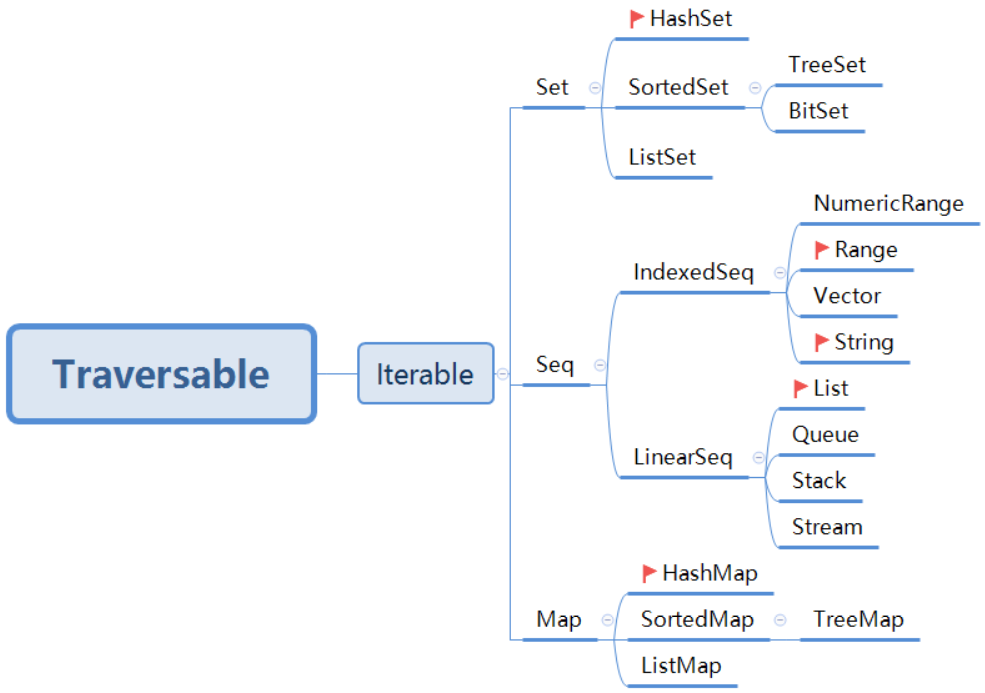
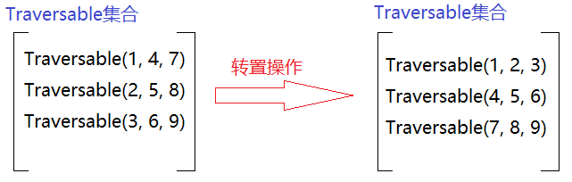

# Scala第十七章节

### 章节目标

1. 了解集合的相关概念
2. 掌握Traversable集合的用法
3. 掌握随机学生序列案例

------

### 1. 集合

#### 1.1 概述

但凡了解过编程的人都知道`程序 = 算法 + 数据结构`这句话, 它是由著名的瑞士计算机科学家`尼古拉斯·沃斯`提出来的, 而他也是1984年图灵奖的获得者. 算法指的是计算的一系列有效, 通用的步骤. 算法和数据结构是程序设计中相辅相成的两个方面, 因此数据结构也是编程中很重要的一个方面. 很多编程语言都提供了数据结构的对应编程库, 

并称之为集合库(Collection Library). Scala中也有集合库, 它的优点如下:

* 易于使用

  > 使用集合库提供的20到50个左右的方法, 灵活的组合运用, 就可以解决大部分的集合问题.

* 简洁

  > 简单的一个单词(例如: foreach), 就可以实现一个或者多个循环操作.

* 安全

  > 绝大部分错误都可以在编译期被发现. 

* 快速

  > 集合类型的方法实现时, 都进行了调优, 用户可以根据需求选择合适的集合.

* 统一

  > Scala的集合有非常严谨的继承体系, 相似类型的集合拥有同样的一组方法, 以及属于自己独有的方法.

#### 1.2 分类

Scala同时支持`不可变集合和可变集合`,  因为不可变集合可以安全的并发访问, 所以它也是默认使用的集合类库. 在Scala中, 对于几乎所有的集合类, 都提供了可变和不可变两个版本, 具体如下:

* 不可变集合: 指的是`集合内的元素一旦初始化完成就不可再进行更改, 任何对集合的改变都将生成一个新的集合.`

  > 都在`scala.collection.immutable`这个包下, 使用时**无需手动导包**.

* 可变集合: 指的是`这个集合本身可以动态变化, 且可变集合提供了改变集合内元素的方法`

  > 都在`scala.collection.mutable`这个包下, 使用是**需要手动导包.**

如下图:



> 小技巧:
>
> 1. 可变集合比不可变集合更加丰富.
>
>    > 例如: 在Seq集合中, 增加了Buffer集合, 我们常用的有: ArrayBuffer和ListBuffer.
>
> 2. 当我们接触一个新的继承体系是, 建议采用`学顶层, 用底层`的方式.
>
>    * 顶层定义的是整个继承体系所共有的内容.
>
>    * 而底层才是具体的体现, 实现.
>


### 2. Traversable

#### 2.1 概述

Traversable是一个特质(trait), 它是其他集合的父特质, 它的子特质immutable.Traversable和mutable.Traversable分别是不可变集合和可变集合的父特质, 集合中大部分通用的方法都是在这个特质中定义的. 因此了解它的功能对学习其他集合类至关重要. 

#### 2.2 格式

* 格式一: 创建空的Traversable对象.

  ```scala
  //方式一: 通过empty方法实现.
  val t1 = Traversable.empty[Int]
  
  //方式二: 通过小括号方式实现
  val t2 = Traversable[Int]()
  
  //方式三: 通过Nil实现.
  val t3 = Nil
  ```

* 格式二: 创建带参数的Traversable对象.

  ```scala
  //方式一: 通过toTraversable()方法实现
  val t1 = List(1, 2, 3).toTraversable
  
  //方式二: 通过Traversable的伴生对象的apply()方法实现. 
  val t1 = Traversable(1, 2, 3)
  ```

#### 2.3 示例一: 创建Traversable对象

1. 创建空的, 用来存储Int类型数据的Traversable对象.
2. 创建Traversable集合对象, 存储数字1, 2, 3, 并将结果打印到控制台上.

**参考代码**

```scala
//案例: 演示创建Traversable对象.
object ClassDemo01 {
  def main(args: Array[String]): Unit = {
    //1. 创建空的, 用来存储Int类型数据的Traversable对象.
    //1.1 创建对象.
    val t1: Traversable[Int] = Traversable.empty[Int]
    val t2: Traversable[Int] = Traversable[Int]()
    val t3: Traversable[Int] = Nil
    //1.2 比较它们是否相等.
    println(t1 == t2)   //==比较的是集合中的数据. true
    println(t1 == t3)   // true
    println(t2 == t3)   // true

    println(t1 eq t2)   //eq比较的是集合的地址值. true
    println(t1 eq t3)   // true
    println(t2 eq t3)   // true
    println("-" * 15)

    //2. 创建Traversable集合对象, 存储数字1, 2, 3, 并将结果打印到控制台上.
    //2.1 通过toTraversable()方法实现.
    val t4: Traversable[Int] = List(1, 2, 3).toTraversable
    val t5: Traversable[Int] = Set(1, 2, 3).toTraversable

    //2. 通过Traversable的伴生对象的apply()方法实现.
    val t6:Traversable[Int] = Traversable(11, 22, 33, 44, 55)

    //3. 打印结果(因为Traversable是特质, 所以底层还是通过它的具体子类来实现的).
    println(s"t4: ${t4}")
    println(s"t5: ${t5}")
    println(s"t6: ${t6}")
  }
}
```


#### 2.4 案例二: 转置Traversable集合

了解过线性代数的同学都知道, 矩阵有一个转置的操作, 在Scala中, 可以通过`transpose()方法`来实现类似的操作.

如下图:



> 注意: 
>
> 进行转置操作时, 程序会自动检测每个集合中的元素个数是否一致, 如果一致, 则转置成功. 如果不一致, 则报错.

**需求**

1. 定义一个Traversable集合t1, 它有三个元素, 每个元素都是Traversable集合, 并分别存储如下数据: 
2. 第一个元素存储(1, 4, 7), 第二个元素存储(2, 5, 8), 第三个元素存储(3, 6, 9).
3. 通过transpose方法, 对集合t1进行转置操作.
4. 打印结果.

**参考代码**

```scala
//案例: 演示转置集合.
object ClassDemo02 {
  def main(args: Array[String]): Unit = {
    //1. 定义一个Traversable集合t1, 它有三个元素, 每个元素都是Traversable集合, 并分别存储如下数据:
    //2. 第一个元素存储(1, 4, 7), 第二个元素存储(2, 5, 8), 第三个元素存储(3, 6, 9).
    val t1 = Traversable(Traversable(1, 4, 7), Traversable(2, 5, 8), Traversable(3, 6, 9))
    //3. 通过transpose方法, 对集合t1进行转置操作.
    val t2 = t1.transpose
    //4. 打印结果.
    println(t2)
  }
}
```


#### 2.5 案例三: 拼接集合

在实际开发中, 数据是从多渠道获取到的, 所以我们经常需要拼接一些数据, 在Scala中, 我们可以通过`++`来拼接数据, 但是这种方式会创建大量的临时集合(即: 每++一次, 就会创建一个新的临时集合), 针对这种情况, 我们可以通过`concat()方法`来实现. 该方法会预先计算出所需的集合的大小, 然后生成一个集合, 减少了中间无用的临时集合, 所以它更加有效. 

**需求**

1. 已知有三个Traversable集合, 分别存储(11, 22, 33), (44, 55), (66, 77, 88, 99)元素. 
2. 通过concat()方法拼接上述的三个集合.
3. 将拼接后的结果打印到控制台上.

**参考代码**

```scala
//案例: 演示concat()方法, 拼接集合.
object ClassDemo03 {
  def main(args: Array[String]): Unit = {
    //1. 已知有三个Traversable集合, 分别存储(11, 22, 33), (44, 55), (66, 77, 88, 99)元素.
    val t1 = Traversable(11, 22, 33)
    val t2 = Traversable(44, 55)
    val t3 = Traversable(66, 77, 88, 99)
    //2. 通过concat()方法拼接上述的三个集合.
    val t4 = Traversable.concat(t1, t2, t3)
    //3. 将拼接后的结果打印到控制台上.
    println(s"拼接后结果为: ${t4}")
  }
}
```


#### 2.6 案例四: 利用偏函数筛选元素

在Scala中, 我们还可以通过`collect()方法`实现`偏函数结合集合`来使用, 从而来从集合中筛选指定的数据. 

**格式**

```scala
def collect[B](pf: PartialFunction[A, B]): Traversable[B]
```

> 解释:
>
> 1. `[B]`表示通过偏函数处理后, 返回值的数据类型.
> 2. `pf: PartialFunction[A, B]`表示collect()方法需要传入一个偏函数对象.
> 3. `Traversable[B]`表示返回的具体数据的集合.

**需求**

1. 已知有一个Traversable集合, 存储元素为: 1, 2, 3, 4, 5, 6, 7, 8, 9, 10.
2. 通过collect方法筛选出集合中所有的偶数. 

**参考代码**

```scala
//案例: 通过偏函数筛选出集合中所有的偶数.
object ClassDemo04 {
  def main(args: Array[String]): Unit = {
    //1. 已知有一个Traversable集合, 存储元素为: 1, 2, 3, 4, 5, 6, 7, 8, 9, 10.
    val t1 = (1 to 10).toTraversable

    //2. 通过collect方法筛选出集合中所有的偶数.
    val t2 = t1.collect( {
      case x if x % 2 == 0 => x
    })

    //3. 打印结果.
    println(t2)
  }
}

```


#### 2.7 案例五: 计算集合元素的阶乘

假设一个Traversable[Int]集合中包含(1, 2, 3, 4, 5)五个数字, 如果让我们计算每个元素的阶乘, 并放到一个新的Traversable[Int]集合中, 我们可以通过递归来实现, 但是这种实现方式有弊端, 每次计算都是从头开始计算的, 例如: 获取5的阶乘, 是通过`5 * 4 * 3 * 2 * 1`计算出来的, 并没有运用之前计算出来的4的阶乘的结果. 此时, 我们就可以通过`scan()方法`来优化此需求了, 它不仅将中间的计算结果放入新的集合中, 并且还会把中间结果传递给下一次的函数调用.

**格式**

```scala
def scan[B](z: B)(op: (B, B) => B)
```

> 解释:
>
> 1. `[B]`表示返回值的数据类型.
> 2. `(z: B)`表示初始化值.
> 3. `(op: (B, B) => B)`表示一个具体的运算函数.
> 4. scan()方法等价于scanLeft()方法,  还有一个跟它相反的方法scanRight().

**需求**

1. 定义Traversable集合t1, 存储1, 2, 3, 4, 5这五个数字.
2. 假设初始值为1, 通过scan()方法, 分别获取t1集合中各个元素的阶乘值.
3. 打印结果.

**参考代码**

```scala
//案例: 通过scan()方法, 获取集合中元素的阶乘值.
object ClassDemo05 {
  def main(args: Array[String]): Unit = {
    //1. 定义Traversable集合t1, 存储1, 2, 3, 4, 5这五个数字.
    val t1 = Traversable(1, 2, 3, 4, 5)
    //2. 假设初始值为1, 通过scan()方法, 分别获取t1集合中各个元素的阶乘值.
    val t2 = t1.scan(1)(_ * _)
    //3. 打印结果.
    println(t2)
  }
}
```


#### 2.8 案例六: 获取集合的指定元素

集合是用来存储数据的, 既然能存储, 那肯定也可以从集合中获取我们想要的数据, 可以通过如下的方法实现:

* head: 获取集合的第一个元素, 如果元素不存在, 则抛出`NoSuchElementException异常`.

* last: 获取集合的最后一个元素, 如果元素不存在, 则抛出`NoSuchElementException异常`.

* headOption: 获取集合的第一个元素, 返回值类型是Option.

* lastOption: 获取集合的最后一个元素, 返回值类型是Option.

* find: 查找集合中第一个满足指定条件的元素.

* slice: 截取集合中的一部分元素.

  ```scala
  def slice(from:Int, until: Int): Traversable[A]	
  ```

  > 注意:
  >
  > 截取从from(起始索引)开始, 至until索引(结束索引)结束的元素, 包含from索引, 但是不包含until索引.

**需求**

1. 定义一个Traversable集合, 包含1, 2, 3, 4, 5, 6这六个元素.
2. 分别通过head, headOption, last, lastOption获取集合中的首尾第一个元素, 并打印.
3. 通过find方法获取集合中第一个偶数, 并打印.
4. 通过slice()方法获取3, 4, 5这三个元素, 并将它们放到一个新的Traversable集合中, 然后打印结果.

**参考代码**

```scala
//案例: 获取Traversable对象的特定的元素
object ClassDemo06 {
  def main(args: Array[String]): Unit = {
    //1. 定义一个Traversable集合, 包含1, 2, 3, 4, 5, 6这六个元素.
    val t1 = (1 to 6).toTraversable
    //2. 分别通过head, headOption, last, lastOption获取集合中的首尾第一个元素, 并打印.
    println(t1.head)
    println(t1.last)
    println(t1.headOption)
    println(t1.lastOption)
    //3. 通过find方法获取集合中第一个偶数, 并打印.
    println(t1.find(_ % 2 == 0))
    //4. 通过slice()方法获取3, 4, 5这三个元素, 然后打印结果.
    val t2 = t1.slice(2, 5)
    println(t2)
  }
}
```


#### 2.9 案例七: 判断元素是否合法

如果我们遇到`判断集合中所有的元素是否都满足指定的条件, 或者任意元素满足指定的条件`这种需求时, 就可以考虑使用`forall()方法和exists()方法`来实现了.

* forall(): 如果集合中所有元素都满足指定的条件则返回true, 否则返回false.

  ```scala
  def forall(p: (A) => Boolean): Boolean
  ```

* exist(): 只要集合中任意一个元素满足指定的条件就返回true, 否则返回false.

  ```scala
  def exists(p: (A) => Boolean): Boolean
  ```

**需求**

1. 定义Traversable集合t1, 包含1到6这六个数字.
2. 通过forall()方法实现, 判断t1中的元素是否都是偶数.
3. 通过exists()方法实现, 判断t1中是否有偶数.

**参考代码**

```scala
//案例: 判断元素是否合法
object ClassDemo07 {
  def main(args: Array[String]): Unit = {
    //1. 定义Traversable集合t1, 包含1到6这六个数字.
    val t1 = (1 to 6).toTraversable
    //2. 通过forall()方法实现, 判断t1中的元素是否都是偶数.
    println(t1.forall(_ % 2 == 0))    //所有的元素都要满足条件.
    //3. 通过exists()方法实现, 判断t1中是否有偶数.
    println(t1.exists(_ % 2 == 0))    //只要有一个元素满足条件即可.
  }
}
```


#### 2.10 案例八: 聚合函数

如果我们想`统计集合中满足条件的元素个数, 或者计算集合元素和, 乘积, 求最大值, 最小值等操作` , 就可以用到如下的这些方法了:

* count: 统计集合中满足条件的元素个数.

  ```scala
  def count(p: (A) => Boolean): Int
  ```

* sum: 获取集合中所有的元素和.

* product: 获取集合中所有的元素乘积.

* max: 获取集合中所有元素的最大值.

* min: 获取集合中所有元素的最小值.

**需求**

1. 定义Traversable集合t1, 包含1到6这六个数字.
2. 通过count()方法统计t1集合中所有奇数的个数, 并打印结果.
3. 通过sum()方法获取t1集合中所有的元素和,  并打印结果.
4. 通过product()方法获取t1集合中所有的元素乘积,  并打印结果.
5. 通过max()方法获取t1集合中所有元素的最大值,  并打印结果.
6. 通过min()方法获取t1集合中所有元素的最小值,  并打印结果.

**参考代码**

```scala
//案例: 演示聚合操作.
object ClassDemo08 {
  def main(args: Array[String]): Unit = {
    //1. 定义Traversable集合t1, 包含1到6这六个数字.
    val t1 = (1 to 6).toTraversable
    //2. 通过count()方法统计t1集合中所有奇数的个数, 并打印结果.
    println(t1.count(_ % 2 == 0))
    println(t1.filter(_ % 2 == 0).size)  //不推荐使用, 因为会产生一个新的Traversable对象.
    //3. 通过sum()方法获取t1集合中所有的元素和,  并打印结果.
    println(t1.sum)
    //4. 通过product()方法获取t1集合中所有的元素乘积,  并打印结果.
    println(t1.product)
    //5. 通过max()方法获取t1集合中所有元素的最大值,  并打印结果.
    println(t1.max)
    //6. 通过min()方法获取t1集合中所有元素的最小值,  并打印结果.
    println(t1.min)
  }
}
```


#### 2.11 案例九: 集合类型转换

有时候, 我们需要将Traversable集合转换成其他的集合来进行操作, 这时候就要用`toXxx()方法`了.

> 注意: 上述的Xxx表示目标集合的名称, 例如: toList, toSet, toArray, toSeq等等...

**需求**

1. 定义Traversable集合t1, 包含1到5这五个数字.
2. 将t1集合分别转成数组(Array), 列表(List), 集(Set)这三种形式, 并打印结果.

**参考代码**

```scala
//案例: 集合类型转换.
object ClassDemo09 {
  def main(args: Array[String]): Unit = {
    //1. 定义Traversable集合t1, 包含1到5这五个数字.
    val t1 = (1 to 5).toTraversable
    //2. 将t1集合分别转成数组(Array), 列表(List), 集(Set)这三种形式, 并打印结果.
    val arr = t1.toArray
    val list = t1.toList
    val set = t1.toSet
    //3. 打印结果.
    println(arr)
    println(list)
    println(set)
  }
}
```


#### 2.12 案例十: 填充元素

如果我们需要往集合中快速添加相同元素, 例如: 生成5个都是"abc"的Traversable对象, 就需要用到`fill()和iterate()方法了`,  那如果是想生成指定间隔的队列元素, 就可以通过`range()方法`来实现了, 具体如下: 

* fill()方法: 快速生成指定数量的元素.
* iterate()方法: 根据指定的条件, 生成指定个数的元素.
* range()方法: 生成某个区间内的指定间隔的所有数据. 

**需求**

1. 通过fill()方法, 生成一个Traversable集合, 该集合包含5个元素, 值都是"传智播客".

2. 通过fill()方法, 生成一个Traversable集合, 该集合包含3个随机数.

3. 通过fill()方法, 生成一个Traversable集合, 格式如下: 

   ```scala
   List(List(传智播客, 传智播客), List(传智播客, 传智播客), List(传智播客, 传智播客), List(传智播客, 传智播客), List(传智播客, 传智播客))
   ```

4. 通过iterate()方法, 生成一个Traversable集合, 该集合包含5个元素, 分别为:1, 10, 100, 1000, 10000.

5. 通过range()方法, 获取从数字1开始, 截止数字21之间, 间隔为5的所有数据. 

**参考代码**

```scala
import scala.util.Random

//案例: 演示填充元素.
object ClassDemo10 {
  def main(args: Array[String]): Unit = {
    //1. 通过fill()方法, 生成一个Traversable集合, 该集合包含5个元素, 值都是"传智播客".
    println(Traversable.fill(5)("传智播客"))
    //2. 通过fill()方法, 生成一个Traversable集合, 该集合包含3个随机数.
    println(Traversable.fill(5)(Random.nextInt(100)))
    //3. 通过fill()方法, 生成一个Traversable集合, 该集合有5个Traversable集合, 每个Traversable集合有两个元素.
    //5表示有5个Traversable, 2表示每个Traversable都有2个元素.
    println(Traversable.fill(5, 2)("传智播客"))
    //4. 通过iterate()方法, 生成一个Traversable集合, 该集合包含5个元素, 分别为:1, 10, 100, 1000, 10000.
    //1表示初始化值, 5表示最终要获取的元素个数
    println(Traversable.iterate(1, 5)(_ * 10))
    //5. 通过range()方法, 获取从数字1开始, 截止数字21之间, 间隔为5的所有数据.
    println(Traversable.range(1, 21, 5))  //从1开始, 截止到20, 间隔5的所有数据
    println(Traversable.range(1, 5))  //从1开始, 截止到5, 间隔1的所有数据(如果不指定, 默认间隔为1)
  }
}
```


### 3. 案例: 随机学生序列

#### 3.1 需求

1. 定义一个Traversable集合, 包含5个学生(属性为: 姓名, 年龄)的信息, 且学生的姓名和年龄信息是随机生成的.
   * 假设姓名信息为("张三", "李四", "王五", "赵六", "田七"), 年龄的取值范围是: [20, 30), 前闭后开写法.
2. 按照学生的年龄信息降序排列后, 将结果打印到控制台上.

#### 3.2 目的

考察`样例类, 随机数, 集合`相关的内容.

#### 3.3 步骤

1. 创建Student样例类, 属性为: 姓名, 年龄, 用来记录学生的信息. 
2. 定义列表, 记录学生的姓名信息, 值为: "张三", "李四", "王五", "赵六", "田七".
3. 创建随机数对象r, 用来实现获取一些随机值的操作.
4. 创建Traversable集合, 包含5个随机的学生信息.
5. 将Traversable集合转换成List列表.
6. 通过列表的sortWith()方法, 按照学生的年龄降序排列.
7. 打印结果.

#### 3.4 参考代码

```scala
import scala.util.Random

//案例: 随机学生序列
object ClassDemo11 {
  //1. 创建Student样例类, 属性为: 姓名, 年龄, 用来记录学生的信息.
  case class Student(name:String, age:Int)

  def main(args: Array[String]): Unit = {
    //2. 定义列表, 记录学生的姓名信息, 值为: "张三", "李四", "王五", "赵六", "田七".
    val names: List[String] = List("张三", "李四", "王五", "赵六", "田七")
    //3. 创建随机数对象r, 用来实现获取一些随机值的操作.
    val r: Random = new Random()
    //4. 创建Traversable集合, 包含5个随机的学生信息.
    val t1: Traversable[Student] = Traversable.fill(5)(Student(names(r.nextInt(names.size)), 20 + r.nextInt(10)))
    //5. 将Traversable集合转换成List列表.
    val t2: List[Student] = t1.toList
    //6. 通过列表的sortWith()方法, 按照学生的年龄降序排列.
    //下边两种排序方式都可以.
    //val t3 = t2.sortBy(_.age).reverse
    val t3 = t2.sortWith(_.age > _.age)
    //7. 打印结果.
    println(t3)
  }
}
```