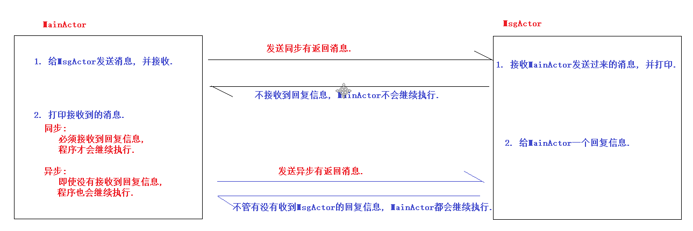
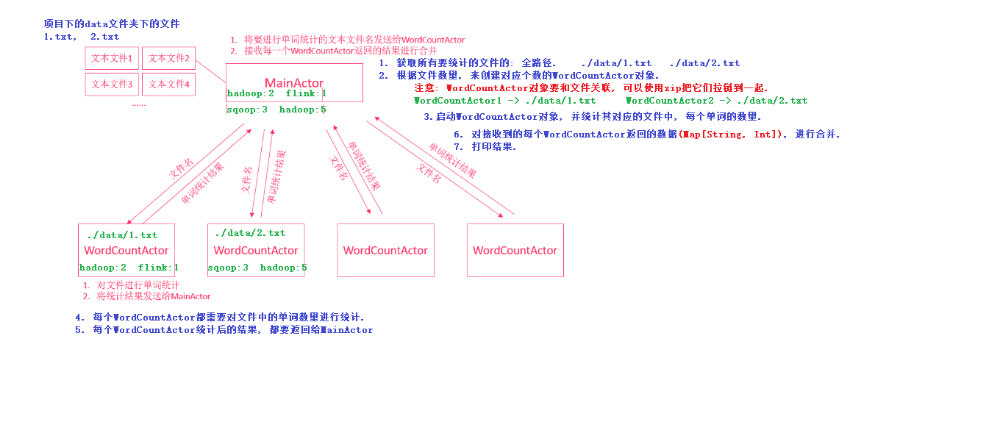

# Scala第十九章节

### 章节目标

1. 了解Actor的相关概述
2. 掌握Actor发送和接收消息
3. 掌握WordCount案例

---

### 1. Actor介绍 

Scala中的Actor并发编程模型可以用来开发比Java线程效率更高的并发程序。我们学习Scala Actor的目的主要是为后续学习Akka做准备。

#### 1.1 Java并发编程的问题

在Java并发编程中，每个对象都有一个逻辑监视器（monitor），可以用来控制对象的多线程访问。我们添加sychronized关键字来标记，需要进行同步加锁访问。这样，通过加锁的机制来确保同一时间只有一个线程访问共享数据。但这种方式存在资源争夺、以及死锁问题，程序越大问题越麻烦。


**线程死锁**


#### 1.2 Actor并发编程模型

Actor并发编程模型，是Scala提供给程序员的一种与Java并发编程完全不一样的并发编程模型，是一种基于事件模型的并发机制。Actor并发编程模型是一种不共享数据，依赖消息传递的一种并发编程模式，有效避免资源争夺、死锁等情况。


#### 1.3 Java并发编程对比Actor并发编程

| Java内置线程模型                                  | Scala Actor模型                      |
| ------------------------------------------------- | ------------------------------------ |
| "共享数据-锁"模型 (share data and lock)           | share nothing                        |
| 每个object有一个monitor，监视线程对共享数据的访问 | 不共享数据，Actor之间通过Message通讯 |
| 加锁代码使用synchronized标识                      |                                      |
| 死锁问题                                          |                                      |
| 每个线程内部是顺序执行的                          | 每个Actor内部是顺序执行的            |

> 注意: 
>
> 1. scala在2.11.x版本中加入了Akka并发编程框架，老版本已经废弃。
>
> 2. Actor的编程模型和Akka很像，我们这里学习Actor的目的是为学习Akka做准备。


### 2. 创建Actor

我们可以通过类(class)或者单例对象(object), 继承Actor特质的方式, 来创建Actor对象.

#### 2.1 步骤

1. 定义class或object继承Actor特质
2. 重写act方法
3. 调用Actor的start方法执行Actor

> 注意: 每个Actor是并行执行的, 互不干扰.

#### 2.2 案例一: 通过class实现

**需求**

1. 创建两个Actor，一个Actor打印1-10，另一个Actor打印11-20
2. 使用class继承Actor实现.（如果需要在程序中创建多个相同的Actor）

**参考代码**

```scala
import scala.actors.Actor

//案例:Actor并发编程入门, 通过class创建Actor
object ClassDemo01 {

  //需求: 创建两个Actor，一个Actor打印1-10，另一个Actor打印11-20
  //1. 创建Actor1, 用来打印1~10的数字.
  class Actor1 extends Actor {
    override def act(): Unit = for (i <- 1 to 10) println("actor1: " + i)
  }

  //2. 创建Actor2, 用来打印11~20的数字.
  class Actor2 extends Actor {
    override def act(): Unit = for (i <- 11 to 20) println("actor2: " + i)
  }

  def main(args: Array[String]): Unit = {
    //3. 启动两个Actor.
    new Actor1().start()
    new Actor2().start()
  }
}
```


#### 2.3 案例二: 通过object实现

**需求**

1. 创建两个Actor，一个Actor打印1-10，另一个Actor打印11-20
2. 使用object继承Actor实现.（如果在程序中只创建一个Actor）

**参考代码**

```scala
import scala.actors.Actor

//案例:Actor并发编程入门, 通过object创建Actor
object ClassDemo02 {
  //需求: 创建两个Actor，一个Actor打印1-10，另一个Actor打印11-20

  //1. 创建Actor1, 用来打印1~10的数字.
  object Actor1 extends Actor {
    override def act(): Unit = for (i <- 1 to 10) println("actor1: " + i)
  }

  //2. 创建Actor2, 用来打印11~20的数字.
  object Actor2 extends Actor {
    override def act(): Unit = for (i <- 11 to 20) println("actor2: " + i)
  }

  def main(args: Array[String]): Unit = {
    //3. 启动两个Actor.
   Actor1.start()
   Actor2.start()
  }
}
```

#### 2.4 Actor程序运行流程

1. 调用start()方法启动Actor
2. 自动执行**act**()方法
3. 向Actor发送消息
4. act方法执行完成后，程序会调用**exit()**方法结束程序执行.


### 3. 发送消息/接收消息

我们之前介绍Actor的时候，说过Actor是基于事件（消息）的并发编程模型，那么Actor是如何发送消息和接收消息的呢？

#### 3.1 使用方式

##### 3.1.1 发送消息

我们可以使用三种方式来发送消息：

| **！** | **发送异步消息，没有返回值**          |
| ------ | ------------------------------------- |
| **!?** | **发送同步消息，等待返回值**          |
| **!!** | **发送异步消息，返回值是Future[Any]** |

例如：要给actor1发送一个异步字符串消息，使用以下代码：

```scala
actor1 ! "你好!"
```


##### 3.1.2 接收消息

Actor中使用`receive方法`来接收消息，需要给receive方法传入一个偏函数

```scala
{
    case 变量名1:消息类型1 => 业务处理1
    case 变量名2:消息类型2 => 业务处理2
    ...
}
```

> 注意: receive方法只接收一次消息，接收完后继续执行act方法


#### 3.2 案例一: 发送及接收一句话

**需求**

1. 创建两个Actor（ActorSender、ActorReceiver）
2. ActorSender发送一个异步字符串消息给ActorReceiver
3. ActorReceiver接收到该消息后，打印出来


**参考代码**

```scala
//案例: 采用 异步无返回的形式, 发送消息.
object ClassDemo03 {
  //1. 创建发送消息的Actor, ActorSender, 发送一句话给ActorReceiver
  object ActorSender extends Actor {
    override def act(): Unit = {
      //发送一句话给ActorReceiver
      ActorReceiver ! "你好啊, 我是ActorSender!"

      //发送第二句话
      ActorReceiver ! "你叫什么名字呀? "
    }
  }

  //2. 创建接收消息的Actor, ActorReceiver
  object ActorReceiver extends Actor {
    override def act(): Unit = {
      //接收发送过来的消息.
      receive {
        case x: String => println(x)
      }
    }
  }

  def main(args: Array[String]): Unit = {
    //3. 启动两个Actor
    ActorSender.start()
    ActorReceiver.start()
  }
}
```


#### 3.3 案例二: 持续发送和接收消息

如果我们想实现`ActorSender一直发送消息, ActorReceiver能够一直接收消息`，该怎么实现呢？

答: 我们只需要使用一个while(true)循环，不停地调用receive来接收消息就可以啦。

**需求**

1. 创建两个Actor（ActorSender、ActorReceiver）
2. ActorSender持续发送一个异步字符串消息给ActorReceiver
3. ActorReceiver持续接收消息，并打印出来

**参考代码**

```scala
//案例:Actor 持续发送和接收消息.
object ClassDemo04 {
  //1. 创建发送消息的Actor, ActorSender, 发送一句话给ActorReceiver
  object ActorSender extends Actor {
    override def act(): Unit = {
        while(true) {
          //发送一句话给ActorReceiver
          ActorReceiver ! "你好啊, 我是ActorSender!"
          //休眠3秒.
          TimeUnit.SECONDS.sleep(3)       //单位是: 秒
        }
    }
  }

  //2. 创建接收消息的Actor, ActorReceiver
  object ActorReceiver extends Actor {
    override def act(): Unit = {
      //接收发送过来的消息,  持续接收.
      while(true) {
        receive {
          case x: String => println(x)
        }
      }
    }
  }

  def main(args: Array[String]): Unit = {
    //3. 启动两个Actor
    ActorSender.start()
    ActorReceiver.start()
  }
}
```


#### 3.4 案例三: 优化持续接收消息

上述代码，是用while循环来不断接收消息的, 这样做可能会遇到如下问题: 

- 如果当前Actor没有接收到消息，线程就会处于阻塞状态
- 如果有很多的Actor，就有可能会导致很多线程都是处于阻塞状态
- 每次有新的消息来时，重新创建线程来处理
- 频繁的线程创建、销毁和切换，会影响运行效率

针对上述情况, 我们可以使用`loop(), 结合react()`来复用线程, 这种方式比`while循环 + receive()`更高效.

**需求**

1. 创建两个Actor（ActorSender、ActorReceiver）
2. ActorSender持续发送一个异步字符串消息给ActorReceiver
3. ActorReceiver持续接收消息，并打印出来

> 注意: 使用loop + react重写上述案例.

**参考代码**

```scala
//案例: 使用loop + react循环接收消息.
object ClassDemo05 {

  //1. 创建发送消息的Actor, ActorSender, 发送一句话给ActorReceiver
  object ActorSender extends Actor {
    override def act(): Unit = {
      while(true) {
        //发送一句话给ActorReceiver
        ActorReceiver ! "你好啊, 我是ActorSender!"
        //休眠3秒.
        TimeUnit.SECONDS.sleep(3)       //单位是: 秒
      }
    }
  }

  //2. 创建接收消息的Actor, ActorReceiver
  object ActorReceiver extends Actor {
    override def act(): Unit = {
      //接收发送过来的消息,  持续接收.
      loop{
        react {
          case x: String => println(x)
        }
      }
    }
  }

  def main(args: Array[String]): Unit = {
    //3. 启动两个Actor
    ActorSender.start()
    ActorReceiver.start()
  }
}
```


#### 3.5 案例四: 发送和接收自定义消息

我们前面发送的消息都是字符串类型，Actor中也支持发送自定义消息，例如：使用样例类封装消息，然后进行发送处理。

##### 3.5.1 示例一: 发送同步有返回消息

**需求**

1. 创建一个MsgActor，并向它发送一个同步消息，该消息包含两个字段（id、message）
2. MsgActor回复一个消息，该消息包含两个字段（message、name）
3. 打印回复消息

> 注意:
>
> - 使用`!?`来发送同步消息
> - 在Actor的act方法中，可以使用sender获取发送者的Actor引用

**参考代码**

```scala
//案例: Actor发送和接收自定义消息, 采用 同步有返回的形式
object ClassDemo06 {

  //1. 定义两个样例类Message(表示发送数据),   ReplyMessage(表示返回数据.)
  case class Message(id: Int, message: String) //自定义的发送消息 样例类
  case class ReplyMessage(message: String, name: String) //自定义的接收消息 样例类


  //2. 创建一个MsgActor，用来接收MainActor发送过来的消息, 并向它回复一条消息.
  object MsgActor extends Actor {
    override def act(): Unit = {
      //2.1 接收 主Actor(MainActor) 发送过来的消息.
      loop {
        react {
          //结合偏函数使用
          case Message(id, message) => println(s"我是MsgActor, 我收到的消息是: ${id}, ${message}")

          //2.2 给MainActor回复一条消息.
          //sender: 获取消息发送方的Actor对象
          sender ! ReplyMessage("我很不好, 熏死了!...", "车磊")
        }
      }
    }
  }

  def main(args: Array[String]): Unit = {
    //3. 开启MsgActor
    MsgActor.start()

    //4. 通过MainActor, 给MsgActor发送一个 Message对象.
    //采用 !?  同步有返回.
    val reply:Any = MsgActor !? Message(1, "你好啊, 我是MainActor, 我在给你发消息!")
    //resutl表示最终接收到的 返回消息.
    val result = reply.asInstanceOf[ReplyMessage]
    //5. 输出结果.
    println(result)
  }
}
```


##### 3.5.2 示例二: 发送异步无返回消息

**需求**

创建一个MsgActor，并向它发送一个异步无返回消息，该消息包含两个字段（id, message）

> 注意: 使用`!`发送异步无返回消息
>

**参考代码**

```scala
//案例: Actor发送和接收自定义消息, 采用 异步 无返回的形式
object ClassDemo07 {

  //1. 定义一个样例类Message(表示发送数据)
  case class Message(id: Int, message: String) //自定义的发送消息 样例类

  //2. 创建一个MsgActor，用来接收MainActor发送过来的消息, 并打印.
  object MsgActor extends Actor {
    override def act(): Unit = {
      //2.1 接收 主Actor(MainActor) 发送过来的消息.
      loop {
        react {
          //结合偏函数使用
          case Message(id, message) => println(s"我是MsgActor, 我收到的消息是: ${id}, ${message}")
        }
      }
    }
  }

  def main(args: Array[String]): Unit = {
    //3. 开启MsgActor
    MsgActor.start()

    //4. 通过MainActor, 给MsgActor发送一个 Message对象.
    //采用 !  异步无返回
   MsgActor ! Message(1, "我是采用 异步无返回 的形式发送消息!")

  }
}
```


##### 3.5.3 示例三: 发送异步有返回消息

**需求**

1. 创建一个MsgActor，并向它发送一个异步有返回消息，该消息包含两个字段（id、message）
2. MsgActor回复一个消息，该消息包含两个字段（message、name）
3. 打印回复消息

> 注意: 
>
> - 使用`!!`发送异步有返回消息
> - 发送后，返回类型为Future[Any]的对象
> - Future表示异步返回数据的封装，虽获取到Future的返回值，但不一定有值，可能在将来某一时刻才会返回消息
> - Future的isSet()可检查是否已经收到返回消息，apply()方法可获取返回数据

**图解**



**参考代码**

```scala
//案例: Actor发送和接收自定义消息, 采用 异步有返回的形式
object ClassDemo08 {

  //1. 定义两个样例类Message(表示发送数据),   ReplyMessage(表示返回数据.)
  case class Message(id: Int, message: String) //自定义的发送消息 样例类
  case class ReplyMessage(message: String, name: String) //自定义的接收消息 样例类


  //2. 创建一个MsgActor，用来接收MainActor发送过来的消息, 并向它回复一条消息.
  object MsgActor extends Actor {
    override def act(): Unit = {
      //2.1 接收 主Actor(MainActor) 发送过来的消息.
      loop {
        react {
          //结合偏函数使用
          case Message(id, message) => println(s"我是MsgActor, 我收到的消息是: ${id}, ${message}")

            //2.2 给MainActor回复一条消息.
            //sender: 获取消息发送方的Actor对象
            sender ! ReplyMessage("我很不好, 熏死了!...", "糖糖")
        }
      }
    }
  }

  def main(args: Array[String]): Unit = {
    //3. 开启MsgActor
    MsgActor.start()

    //4. 通过MainActor, 给MsgActor发送一个 Message对象.
    //采用 !!  异步有返回.
    val future: Future[Any] = MsgActor !! Message(1, "你好啊, 我是MainActor, 我在给你发消息!")

    //5. 因为future中不一定会立马有数据, 所以我们要校验.
    //Future的isSet()可检查是否已经收到返回消息，apply()方法可获取返回数据
    //!future.isSet表示: 没有接收到具体的返回消息, 就一直死循环.
    while(!future.isSet){}

    //通过Future的apply()方法来获取返回的数据.
    val result = future.apply().asInstanceOf[ReplyMessage]
    //5. 输出结果.
    println(result)
  }
}
```


### 4. 案例: WordCount

#### 4.1 需求

接下来，我们要使用Actor并发编程模型实现`多文件的单词统计`。

**案例介绍**

给定几个文本文件（文本文件都是以空格分隔的），使用Actor并发编程来统计单词的数量.

**思路分析**



**实现思路**

1. MainActor获取要进行单词统计的文件
2. 根据文件数量创建对应的WordCountActor
3. 将文件名封装为消息发送给WordCountActor
4. WordCountActor接收消息，并统计单个文件的单词计数
5. 将单词计数结果发送给MainActor
6. MainActor等待所有的WordCountActor都已经成功返回消息，然后进行结果合并


#### 4.2 步骤一: 获取文件列表

**实现思路**

1. 在当前项目下的data文件夹下有: 1.txt, 2.txt两个文本文件, 具体存储内容如下: 

   > 1.txt文本文件存储内容如下:
   >
   > ```scala
   > hadoop sqoop hadoop
   > hadoop hadoop flume
   > hadoop hadoop hadoop
   > spark
   > ```
   >
   > 2.txt文本文件存储内容如下:
   >
   > ```scala
   > flink hadoop hive
   > hadoop sqoop hadoop
   > hadoop hadoop hadoop
   > spark
   > ```

2. 获取上述两个文本文件的路径, 并将结果打印到控制台上.

**参考代码**

```scala
object MainActor {

  def main(args: Array[String]): Unit = {
    //1. 获取所有要统计的文件的路径.
    //1.1 定义变量dir, 记录保存所有文件的: 文件夹路径.  ./data/
    var dir = "./data/"
    //1.2 获取该文件夹下, 所有的文件名.
    var fileNameList = new File(dir).list().toList //List("1.txt", "2.txt")
    //1.3 对获取到的文件名进行封装, 获取其全路径.     ./data/1.txt      ./data/2.txt
    var fileDirList = fileNameList.map(dir + _)
    //println(fileDirList)
  }
}
```


#### 4.3 步骤二: 创建WordCountActor

**实现思路**

1. 根据文件数量创建对应个数的WordCountActor对象. 
2. 为了方便后续发送消息给Actor，将每个Actor与文件名关联在一起

**实现步骤**

1. 创建WordCountActor
2. 将文件列表转换为WordCountActor
3. 为了后续方便发送消息给Actor，将Actor列表和文件列表拉链到一起
4. 打印测试

**参考代码**

* WordCountActor.scala文件中的代码

  ```scala
  //2.1 先创建WordCountActor类, 用来获取WordCountActor对象.
  //创建WordCountActor类, 每一个WordCountActor对象, 统计一个文件.
  class WordCountActor extends Actor {
    override def act(): Unit = { 
    }
  }
  
  ```

* MainActor.scala文件中的代码

  ```scala
  object MainActor {
  
    def main(args: Array[String]): Unit = {
      //1. 获取所有要统计的文件的路径.
      //1.1 定义变量dir, 记录保存所有文件的: 文件夹路径.  ./data/
      var dir = "./data/"
      //1.2 获取该文件夹下, 所有的文件名.
      var fileNameList = new File(dir).list().toList //List("1.txt", "2.txt")
      //1.3 对获取到的文件名进行封装, 获取其全路径.     ./data/1.txt      ./data/2.txt
      var fileDirList = fileNameList.map(dir + _)
      //println(fileDirList)
  
      //2. 根据文件数量, 创建对应的WordCountActor对象.
      //2.1 先创建WordCountActor类, 用来获取WordCountActor对象.
      //2.2 根据文件数量, 创建对应的WordCountActor对象.
      val wordCountList = fileNameList.map(_ => new WordCountActor) //根据两个txt文件, 创建了两个wordCount对象.
      //println(wordCountList)
      //2.3 将WordCountActor和文件全路径关联起来
      val actorWithFile = wordCountList.zip(fileDirList) //WordCountActor -> ./data/1.txt ,  WordCountActor -> ./data/2.txt
      println(actorWithFile)
    }
  }
  ```


#### 4.4 步骤三: 启动Actor/发送/接收任务消息

**实现思路**

启动所有WordCountActor对象，并发送单词统计任务消息给每个WordCountActor对象.

> 注意: 此处应`发送异步有返回消息`

**实现步骤**

1. 创建一个WordCountTask样例类消息，封装要进行单词计数的文件名
2. 启动所有WordCountActor，并发送异步有返回消息
3. 获取到所有的WordCountActor中返回的消息（封装到一个Future列表中）
4. 在WordCountActor中接收并打印消息

**参考代码**

* MessagePackage.scala文件中的代码

  ```scala
  /**
    * 表示: MainActor 给每一个WordCountActor发送任务的 格式.
    * @param fileName 具体的要统计的 文件路径.
    */
  case class WordCountTask(fileName:String)
  ```

* MainActor.scala文件中的代码

  ```scala
  object MainActor {
  
    def main(args: Array[String]): Unit = {
      //1. 获取所有要统计的文件的路径.
      //1.1 定义变量dir, 记录保存所有文件的: 文件夹路径.  ./data/
      var dir = "./data/"
      //1.2 获取该文件夹下, 所有的文件名.
      var fileNameList = new File(dir).list().toList //List("1.txt", "2.txt")
      //1.3 对获取到的文件名进行封装, 获取其全路径.     ./data/1.txt      ./data/2.txt
      var fileDirList = fileNameList.map(dir + _)
      //println(fileDirList)
  
      //2. 根据文件数量, 创建对应的WordCountActor对象.
      //2.1 先创建WordCountActor类, 用来获取WordCountActor对象.
      //2.2 根据文件数量, 创建对应的WordCountActor对象.
      val wordCountList = fileNameList.map(_ => new WordCountActor) //根据两个txt文件, 创建了两个wordCount对象.
      //println(wordCountList)
      //2.3 将WordCountActor和文件全路径关联起来
      val actorWithFile = wordCountList.zip(fileDirList) //WordCountActor -> ./data/1.txt ,  WordCountActor -> ./data/2.txt
      println(actorWithFile)
  
      //3. 启动WordCountActor, 并给每一个WordCountActor发送任务.
      /*
        Map(spark -> 1, hadoop -> 7, sqoop -> 1, flume -> 1)
        Map(sqoop -> 1, flink -> 1, hadoop -> 6, spark -> 1, hive -> 1)
       */
      val futureList: List[Future[Any]] = actorWithFile.map {       //futureList: 记录的是所有WordCountActor统计的结果.
        keyVal => //keyVal的格式: WordCountActor -> ./data/1.txt
          //3.1 获取具体的要启动的WordCountActor对象.
          val actor = keyVal._1 //actor: WordCountActor
          //3.2 启动具体的WordCountActor.
          actor.start()
          
          //3.3 给每个WordCountActor发送具体的任务(文件路径)  异步有返回.
          val future: Future[Any] = actor !! WordCountTask(keyVal._2)
          future      //记录的是某一个WordCountActor返回的统计结果.
      }
    }
  }
  ```

* WordCountActor.scala文件中的代码

  ```scala
  //2.1 先创建WordCountActor类, 用来获取WordCountActor对象.
  //创建WordCountActor类, 每一个WordCountActor对象, 统计一个文件.
  class WordCountActor extends Actor {
    override def act(): Unit = { 
        loop {
            react {
              //3.4 接收具体的任务
              case WordCountTask(fileName) =>
                //3.5 打印具体的任务
                println(s"接收到的具体任务是: ${fileName}")
            }
        }
    }
  }
  ```


#### 4.5 步骤四: 统计文件单词计数

**实现思路**

读取文件文本，并统计出来单词的数量。例如：

```html
(hadoop, 3), (spark, 1)...
```

**实现步骤**

1. 读取文件内容，并转换为列表
2. 按照空格切割文本，并转换为一个一个的单词
3. 为了方便进行计数，将单词转换为元组
4. 按照单词进行分组，然后再进行聚合统计
5. 打印聚合统计结果

**参考代码**

* WordCountActor.scala文件中的代码

  ```scala
  class WordCountActor extends Actor {
    override def act(): Unit = {
      //采用loop + react 方式接收数据.
      loop {
        react {
          //3.4 接收具体的任务
          case WordCountTask(fileName) =>
            //3.5 打印具体的任务
            println(s"接收到的具体任务是: ${fileName}")
  
          //4. 统计接收到的文件中的每个单词的数量.
          //4.1 获取指定文件中的所有的文件. List("hadoop sqoop hadoop","hadoop hadoop flume")
          val lineList = Source.fromFile(fileName).getLines().toList
          //4.2 将上述获取到的数据, 转换成一个一个的字符串.  
          //List("hadoop", "sqoop", "hadoop","hadoop", "hadoop", "flume")
          val strList = lineList.flatMap(_.split(" "))
          //4.3 给每一个字符串后边都加上次数, 默认为1.             
          //List("hadoop"->1, "sqoop"->1, "hadoop"->1, "hadoop"->1, "flume"->1)
          val wordAndCount = strList.map(_ -> 1)
          //4.4 按照 字符串内容分组.                              
          //"hadoop" -> List("hadoop"->1, "hadoop"->1),   "sqoop" -> List("sqoop"->1)
          val groupMap = wordAndCount.groupBy(_._1)
          //4.5 对分组后的内容进行统计, 统计每个单词的总次数.    "hadoop" -> 2,   "sqoop" -> 1
          val wordCountMap = groupMap.map(keyVal => keyVal._1 -> keyVal._2.map(_._2).sum)
          //4.6 打印统计后的结果. 
          println(wordCountMap)
        }
      }
    }
  }
  ```


#### 4.6 步骤五: 返回结果给MainActor

**实现思路**

- 将单词计数的结果封装为一个样例类消息，并发送给MainActor
- MainActor等待所有WordCountActor均已返回后,获取到每个WordCountActor单词计算后的结果

**实现步骤**

1. 定义一个样例类封装单词计数结果
2. 将单词计数结果发送给MainActor
3. MainActor中检测所有WordCountActor是否均已返回，如果均已返回，则获取并转换结果
4. 打印结果

**参考代码**

* MessagePackage.scala文件中的代码

  ```scala
  /**
    * 表示: MainActor 给每一个WordCountActor发送任务的 格式.
    * @param fileName 具体的要统计的 文件路径.
    */
  case class WordCountTask(fileName:String)
  
  
  /**
    * 每个WordCountActor统计完的返回结果的: 格式
    * @param wordCountMap  具体的返回结果, 例如:  Map("hadoop"->6, "sqoop"->1)
    */
  case class WordCountResult(wordCountMap:Map[String, Int])
  ```

* WordCountActor.scala文件中的代码

  ```scala
  class WordCountActor extends Actor {
    override def act(): Unit = {
      //采用loop + react 方式接收数据.
      loop {
        react {
          //3.4 接收具体的任务
          case WordCountTask(fileName) =>
            //3.5 打印具体的任务
            println(s"接收到的具体任务是: ${fileName}")
  
          //4. 统计接收到的文件中的每个单词的数量.
          //4.1 获取指定文件中的所有的文件.                       List("hadoop sqoop hadoop","hadoop hadoop flume")
          val lineList = Source.fromFile(fileName).getLines().toList
          //4.2 将上述获取到的数据, 转换成一个一个的字符串.        List("hadoop", "sqoop", "hadoop","hadoop", "hadoop", "flume")
          val strList = lineList.flatMap(_.split(" "))
          //4.3 给每一个字符串后边都加上次数, 默认为1.             List("hadoop"->1, "sqoop"->1, "hadoop"->1,"hadoop"->1, "hadoop"->1, "flume"->1)
          val wordAndCount = strList.map(_ -> 1)
          //4.4 按照 字符串内容分组.                              "hadoop" -> List("hadoop"->1, "hadoop"->1),   "sqoop" -> List("sqoop"->1)
          val groupMap = wordAndCount.groupBy(_._1)
          //4.5 对分组后的内容进行统计, 统计每个单词的总次数.      "hadoop" -> 2,   "sqoop" -> 1
          val wordCountMap = groupMap.map(keyVal => keyVal._1 -> keyVal._2.map(_._2).sum)
          //4.6 把统计后的结果返回给: MainActor.
          sender ! WordCountResult(wordCountMap)
        }
      }
    }
  }
  ```


#### 4.7 步骤六: 结果合并

**实现思路**

对接收到的所有单词计数进行合并。

**参考代码**

* MainActor.scala文件中的代码

  ```scala
  object MainActor {
  
    def main(args: Array[String]): Unit = {
      //1. 获取所有要统计的文件的路径.
      //1.1 定义变量dir, 记录保存所有文件的: 文件夹路径.  ./data/
      var dir = "./data/"
      //1.2 获取该文件夹下, 所有的文件名.
      var fileNameList = new File(dir).list().toList //List("1.txt", "2.txt")
      //1.3 对获取到的文件名进行封装, 获取其全路径.     ./data/1.txt      ./data/2.txt
      var fileDirList = fileNameList.map(dir + _)
      //println(fileDirList)
  
      //2. 根据文件数量, 创建对应的WordCountActor对象.
      //2.1 先创建WordCountActor类, 用来获取WordCountActor对象.
      //2.2 根据文件数量, 创建对应的WordCountActor对象.
      val wordCountList = fileNameList.map(_ => new WordCountActor) //根据两个txt文件, 创建了两个wordCount对象.
      //println(wordCountList)
      //2.3 将WordCountActor和文件全路径关联起来
      val actorWithFile = wordCountList.zip(fileDirList) //WordCountActor -> ./data/1.txt ,  WordCountActor -> ./data/2.txt
      println(actorWithFile)
  
      //3. 启动WordCountActor, 并给每一个WordCountActor发送任务.
      /*
        Map(spark -> 1, hadoop -> 7, sqoop -> 1, flume -> 1)
        Map(sqoop -> 1, flink -> 1, hadoop -> 6, spark -> 1, hive -> 1)
       */
      val futureList: List[Future[Any]] = actorWithFile.map {       //futureList: 记录的是所有WordCountActor统计的结果.
        keyVal => //keyVal的格式: WordCountActor -> ./data/1.txt
          //3.1 获取具体的要启动的WordCountActor对象.
          val actor = keyVal._1 //actor: WordCountActor
          //3.2 启动具体的WordCountActor.
          actor.start()
  
          //3.3 给每个WordCountActor发送具体的任务(文件路径)  异步有返回.
          val future: Future[Any] = actor !! WordCountTask(keyVal._2)
          future      //记录的是某一个WordCountActor返回的统计结果.
      }
  
      //5. MainActor对接收到的数据进行合并.
      //5.1 判断所有的future都有返回值后, 再往下执行.
      //       过滤没有返回值的future         不为0说明还有future没有收到值
      while(futureList.filter(!_.isSet).size != 0) {} //futureList:  future1, future2
      //5.2 从每一个future中获取数据.
      //wordCountMap:  List(Map(spark -> 1, hadoop -> 7, sqoop -> 1, flume -> 1), Map(sqoop -> 1, flink -> 1, hadoop -> 6, spark -> 1, hive -> 1))
      val wordCountMap = futureList.map(_.apply().asInstanceOf[WordCountResult].wordCountMap)
      //5.3 对获取的数据进行flatten, groupBy, map, 然后统计.
      val result = wordCountMap.flatten.groupBy(_._1).map(keyVal => keyVal._1 -> keyVal._2.map(_._2).sum)
      //5.4 打印结果
      println(result)
    }
  }
  ```

