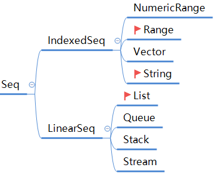
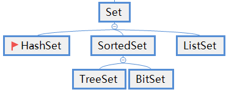
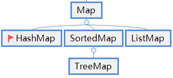

# Scala第十八章节

### 章节目标

1. 掌握Iterable集合相关内容.
2. 掌握Seq集合相关内容.
3. 掌握Set集合相关内容.
4. 掌握Map集合相关内容.
5. 掌握统计字符个数案例.

------

### 1. Iterable

#### 1.1 概述

Iterable代表一个可以迭代的集合, 它继承了Traversable特质, 同时也是其他集合的父特质. 最重要的是, 它定义了获取迭代器(iterator)的方法:  `def iterator: Iterator[A]`, 这是一个抽象方法, 它的具体实现类需要实现这个方法, 从而实现`迭代的返回集合中的元素`.

#### 1.2 分类

Traversable提供了两种遍历数据的方式: 

* 通过iterator()方法实现, 迭代访问元素的功能.

  > 这种方式属于`主动迭代`, 我们可以通过hasNext()检查是否还有元素, 并且可以主动的调用next()方法获取元素, 即: 我们可以自主的控制迭代过程.

* 通过foreach()方法实现, 遍历元素的功能.

  > 这种方式属于`被动迭代`, 我们只提供一个函数, 并不能控制遍历的过程, 即: 迭代过程是由集合本身控制的.

#### 1.3 案例一: 遍历集合

**需求**

1. 定义一个列表,  存储1, 2, 3, 4, 5这五个数字.
2. 通过iterator()方法遍历上述的列表.
3. 通过foreach()方法遍历上述的列表.

**参考代码**

```scala
//案例: 遍历集合元素.
object ClassDemo01 {
  def main(args: Array[String]): Unit = {
    //1. 定义一个列表, 存储1, 2, 3, 4, 5这五个数字.
    val list1 = (1 to 5).toList

    //2. 通过iterator()方法遍历上述的列表.
    val it: Iterator[Int] = list1.iterator
    while(it.hasNext) {
      val ele = it.next()
      println(ele)
      if(ele == 3) println("额外的操作: " + ele * 10)
    }
    println("-" * 15)

    //3. 通过foreach()方法遍历上述的列表.
    list1.foreach(println(_))
  }
}
```


#### 1.4 案例二: 分组遍历

如果遇到`将Iterable对象中的元素分成固定大小的组, 然后遍历`这种需求, 就可以通过`grouped()方法`来实现了.

**格式**

```scala
def grouped(size: Int): Iterator[Iterable[A]]
```

**需求**

1. 定义一个Iterable集合, 存储1~13之间的所有整数.
2. 通过grouped()方法, 对Iterable集合按照5个元素为一组的形式进行分组, 遍历并打印结果.

**参考代码**

```scala
//案例: 演示grouped分组功能.
object ClassDemo02 {
  def main(args: Array[String]): Unit = {
    //1. 定义Iterable集合, 存储1~13之间的数字.
    val i1 = (1 to 13).toIterable
    //2. 通过grouped方法按照5个元素为一组的方式, 对Iterable集合分组.
    val result1 = i1.grouped(5)
    //3. 遍历元素, 打印结果.
    while (result1.hasNext) {
      println(result1.next())
    }
  }
}
```


#### 1.5 案例三: 按照索引生成元组

Iterable集合中存储的每个元素都是有索引的, 如果我们想按照`元素 -> 索引`这种格式, 生成一个新的集合, 此时, 就需要用到`zipWithIndex()方法`了.

**需求**

1. 定义一个Iterable集合, 存储"A", "B", "C", "D", "E"这五个字符串.
2. 通过zipWithIndex()方法, 按照 字符串->索引这种格式, 生成新的集合.
3. 重新按照 索引->字符串这种格式, 生成新的集合.
4. 打印结果.

**参考代码**

```scala
//案例: 按照索引生成元组
object ClassDemo03 {
  def main(args: Array[String]): Unit = {
    //1. 定义一个Iterable集合, 存储"A", "B", "C", "D", "E"这五个字符串.
    val i1 = Iterable("A", "B", "C", "D", "E")
    //2. 通过zipWithIndex()方法, 按照 字符串->索引这种格式, 生成新的集合.
    val i2 = i1.zipWithIndex    //List((A,0), (B,1), (C,2))
    //3. 重新按照 索引->字符串这种格式, 生成新的集合.
    val i3 = i1.zipWithIndex.map(x => x._2 -> x._1)
    //4. 打印结果.
    println(i2)
    println(i3)
  }
}
```


#### 1.6 案例四: 判断集合是否相同

有时候, 我们不仅想`判断两个集合中的元素是否全部相同, 而且还要求这两个集合元素的迭代顺序保持一致`, 此时, 就可以通过`sameElements()方法`来实现该需求了.

> 即sameElements()方法的功能是: 判断集合所包含的元素及元素的迭代顺序是否一致.

**需求**

1. 定义Iterable集合list1, 包含"A", "B", "C"这三个元素.
2. 通过sameElements()方法, 判断list1和Iterable("A", "B", "C")集合是否相同.
3. 通过sameElements()方法, 判断list1和Iterable("A", "C", "B")集合是否相同.
4. 定义Iterable集合list2, 包含"A", "B", "C", "D"这四个元素.
5. 通过sameElements()方法, 判断list1和list2是否相同. 

**参考代码**

```scala
import scala.collection.mutable

//案例: 检查两个Iterable是否包含相同的元素.
object ClassDemo04 {
  def main(args: Array[String]): Unit = {
    //1. 定义Iterable集合i1, 包含"A", "B", "C"这三个元素.
    val i1 = Iterable("A", "B", "C")
    //2. 判断i1和Iterable("A", "B", "C")集合是否相同. true
    println(i1.sameElements(Iterable("A", "B", "C")))
    //3. 判断i1和Iterable("A", "C", "B")集合是否相同. false
    println(i1.sameElements(Iterable("A", "C", "B")))
    //4. 定义Iterable集合i2, 包含"A", "B", "C", "D"这四个元素.
    val i2 = Iterable("A", "B", "C", "D")
    //5. 判断i1和i2是否相同. false
    println(i1.sameElements(i2))

    //6. 扩展: 创建HashSet集合存储1, 2, 创建TreeSet集合存储2, 1, 然后判断它们是否相同.
    val hs = mutable.HashSet(1, 2)
    val ts = mutable.TreeSet(2, 1)
    println(hs.sameElements(ts))    //结果是true, 因为TreeSet会对元素排序.
  }
}
```


### 2. Seq

#### 2.1 概述

Seq特质代表`按照一定顺序排列的元素序列`, 序列是一种特别的可迭代集合,  它的元素特点是`有序(元素存取顺序一致), 可重复, 有索引`. 

#### 2.2 分类

 继承关系如下图:




IndexedSeq和LinearSeq是Seq的子特质, 代表着序列的两大子门派.

1. `IndexedSeq特质`代表索引序列, 相对于Seq来说, 它并没有增加额外的方法, 对于随机访问元素的方法来讲, 它更加有效, 常用的子集合有: NumericRange, Range, Vector, String等.

   * Range集合

     > Range代表一个有序的整数队列, 每个元素之间的间隔相同, 例如奇数队列:1, 3, 5, 7, 9, 但是斐波那契数列1, 1, 2, 3, 5, 8就不属于Range类. 简单来说, Range类似于数学中的等差数列.

   * NumericRange集合

     > NumericRange集合是一个更通用的等差队列, 可以生成Int, BigInteger, Short, Byte等类型的序列.

   * Vector集合

     > Vector是一个通用的不可变的数据结构, 相对来讲, 它获取数据的时间会稍长一些, 但是随机更新数据要比数组和链表快很多.

2. `LinearSeq特质`代表线性序列, 它通过链表的方式实现, 因此它的head, tail, isEmpty执行起来相对更高效. 常用的子集合有: List, Stack, Queue等.

   * Stack: 表示`栈`数据结构, 元素特点是`先进后出`.

     > 由于历史的原因, Scala当前的库中还包含一个immutable.Stack, 但当前已经被标记为弃用, 因为它的设计不怎么优雅, 而且性能也不太好, 因为栈会涉及到大量元素的进出, 所以不可变栈的应用场景还是比较小的, 最常用的还是可变栈, 例如: mutable.Stack, mutable.ArrayStack.

     * mutable.Stack: 是通过List, 也就是链表的方式实现的, 增删快, 查询慢.
     * mutable.ArrayStack: 是通过Array, 也就是数组的方式实现的, 查询快, 增删慢.

   * Queue: 表示`队列`数据结构, 元素特点是`先进先出`.  

#### 2.3 案例一: 创建Seq集合

**需求**

创建Seq集合, 存储元素1, 2, 3, 4, 5, 并打印结果.

**参考代码**

```scala
//案例: 创建Seq对象.
object ClassDemo01 {
  def main(args: Array[String]): Unit = {
    //1. 创建Seq集合, 存储元素1, 2, 3, 4, 5.
    val s1 = (1 to 5).toSeq
    //2. 打印结果.
    println(s1)
  }
}
```


#### 2.4 案例二: 获取长度及元素

因为Seq集合的每个元素都是有索引的, 所以我们可以通过索引直接获取其对应的元素, 而且可以通过`length()或者size()方法获取集合的长度`.

**需求**

1. 创建Seq集合, 存储元素1, 2, 3, 4, 5.
2. 打印集合的长度.
3. 获取索引为2的元素.

**参考代码**

```scala
//案例: 获取长度及元素
object ClassDemo02 {
  def main(args: Array[String]): Unit = {
    //1. 创建Seq集合, 存储元素1, 2, 3, 4, 5.
    val s1 = (1 to 5).toSeq
    //2. 打印集合的长度.
    println(s1.length, s1.size)
    println("-" * 15)

    //3. 获取索引为2的元素.
    println(s1(2))
    println(s1.apply(2))
  }
}
```


#### 2.5 案例三: 获取指定元素的索引值

**格式**

获取指定元素的索引值, 我们可以通过`indexOf(), lastIndexOf(), indexWhere(), lastIndexWhere(),indexOfSlice()`方法来实现, 具体功能如下:

* indexOf: 获取指定元素在列表中第一次出现的位置.
* lastIndexOf: 获取指定元素在列表中最后一次出现的位置.
* indexWhere: 获取满足条件的元素, 在集合中第一次出现的索引.
* lastIndexWhere: 获取满足条件的元素, 在集合中最后一次出现的索引.
* indexOfSlice: 获取指定的子序列在集合中第一次出现的位置.

> 注意: 上述方式都是查找到指定数据后则返回对应的索引, 如果找不到此数据, 则返回-1.

**需求**

1. 定义Seq集合, 存储数据: 1, 2, 4, 6, 4, 3, 2.
2. 获取元素2在集合中第一次出现的索引, 并打印.
3. 获取元素2在集合中最后一次出现的索引, 并打印.
4. 获取集合中, 小于5的第一个偶数的索引, 并打印.
5. 从索引2位置开始查找集合中, 小于5的第一个偶数的索引, 并打印.
6. 获取集合中, 小于5的最后一个偶数的索引, 并打印.
7. 获取子序列Seq(1, 2)在t1集合中, 第一次出现的索引, 并打印.
8. 从索引3开始查找子序列Seq(1, 2)在t1集合中, 第一次出现的索引, 并打印.

**参考代码**

```scala
//案例: 获取指定元素的索引值
object ClassDemo03 {
  def main(args: Array[String]): Unit = {
    //1. 定义Seq集合, 存储数据: 1, 2, 4, 6, 4, 3, 2.
    val s1 = Seq(1, 2, 4, 6, 4, 3, 2)
    //2. 获取元素2在集合中第一次出现的索引, 并打印.
    println(s1.indexOf(2))
    //3. 获取元素2在集合中最后一次出现的索引, 并打印.
    println(s1.lastIndexOf(2))
    println("-" * 15)

    //4. 获取集合中, 小于5的第一个偶数的索引, 并打印.
    println(s1.indexWhere(x => (x % 2 == 0) && x < 5))
    //5. 从索引2位置开始查找集合中, 小于5的第一个偶数的索引, 并打印.
    println(s1.indexWhere(x => (x % 2 == 0) && x < 5, 2))
    //6. 获取集合中, 小于5的最后一个偶数的索引, 并打印.
    println(s1.lastIndexWhere(x => (x % 2 == 0) && x < 5))
     //7. 获取子序列Seq(1, 2)在t1集合中, 第一次出现的索引, 并打印.
    println(s1.indexOfSlice(Seq(1, 2)))
    //8. 从索引3开始查找子序列Seq(1, 2)在t1集合中, 第一次出现的索引, 并打印.
    println(s1.indexOfSlice(Seq(1,2), 3))
  }
}
```


#### 2.6 案例四: 判断是否包含指定数据

如果我们想`判断序列是否以指定的数据开头或者结尾, 以及判断序列是否包含指定的数据`, 就可以通过`startsWith(), endsWith(), contains(), containsSlice()`来实现了, 具体如下: 

* startsWith: 判断集合是否以指定的子序列开头.
* endsWith: 判断集合是否以指定的子序列结尾.
* contains: 判断集合是否包含某个指定的数据.
* containsSlice: 判断集合是否包含某个指定的子序列.

**需求**

1. 定义Seq集合s1, 存储1到10这十个数据.
2. 判断s1集合是否以子序列(1, 2)开头, 并打印结果.
3. 判断s1集合是否以子序列(1, 3)开头, 并打印结果.
4. 判断s1集合是否以子序列(9, 10)结尾, 并打印结果.
5. 判断s1集合是否以子序列(8, 9)结尾, 并打印结果.
6. 判断s1集合是否包含元素3, 并打印结果.
7. 判断s1集合是否包含子序列Seq(1, 2), 并打印结果.
8. 判断s1集合是否包含子序列Seq(1, 3), 并打印结果.

**参考代码**

```scala
//案例: 判断集合是否包含指定数据
object ClassDemo04 {
  def main(args: Array[String]): Unit = {
    //1. 定义Seq集合s1, 存储1到10这十个数据.
    val s1 = (1 to 10).toSeq
    //2. 判断s1集合是否以子序列(1, 2)开头, 并打印结果.
    println(s1.startsWith(Seq(1,2)))
    //3. 判断s1集合是否以子序列(1, 3)开头, 并打印结果.
    println(s1.startsWith(Seq(1,3)))
    //4. 判断s1集合是否以子序列(9, 10)结尾, 并打印结果.
    println(s1.endsWith(Seq(9,10)))
    //5. 判断s1集合是否以子序列(8, 9)结尾, 并打印结果.
    println(s1.endsWith(Seq(8,9)))
    println("-" * 15)
    //6. 判断s1集合是否包含元素3, 并打印结果.
    println(s1.contains(3))
    //7. 判断s1集合是否包含子序列Seq(1, 2), 并打印结果.
    println(s1.containsSlice(Seq(1, 2)))
    //8. 判断s1集合是否包含子序列Seq(1, 3), 并打印结果.
    println(s1.containsSlice(Seq(1, 3)))
  }
}
```


#### 2.7 案例五: 修改指定的元素

如果我们想`修改某个元素值, 或者用指定的子序列来替代集合中的某一段元素`, 就可以通过`updated(), patch()`方法来实现了, 具体如下: 

- updated: 修改指定索引位置的元素为指定的值.

- patch: 修改指定区间的元素为指定的值.

**需求**

1. 定义Seq集合s1, 存储1到5这五个数据.
2. 修改索引2位置的元素值为: 10, 并打印结果.
3. 从索引1开始, 用子序列Seq(10, 20)替换3个元素, 并打印结果.

**参考代码**

```scala
//案例: 修改指定的元素
object ClassDemo05 {
  def main(args: Array[String]): Unit = {
    //1. 定义Seq集合s1, 存储1到5这五个数据.
    val s1 = (1 to 5).toSeq
    //2. 修改索引2位置的元素值为: 10, 并打印结果.
    val s2 = s1.updated(2, 10)
    println(s2)
    //3. 从索引1开始, 用子序列Seq(10, 20)替换3个元素, 并打印结果.
    val s3 = s1.patch(1, Seq(10, 20), 3)
    println(s3)
  }
}
```


### 3. Stack

#### 3.1 概述

 表示`栈`数据结构, 元素特点是`先进后出`. 由于历史的原因, Scala当前的库中还包含一个immutable.Stack, 但当前已经被标记为弃用, 因为它的设计不怎么优雅, 而且性能也不太好, 因为栈会涉及到大量元素的进出, 所以不可变栈的应用场景还是比较小的, 最常用的还是可变栈, 例如: mutable.Stack, mutable.ArrayStack.

#### 3.3 常用方法

* top: 获取栈顶元素, 但是不会把这个元素从栈顶移除.
* push: 表示入栈操作, 相当于把元素压入栈顶
* pop: 移除栈顶元素, 并返回此元素.
* clear: 移除集合中所有的元素.

> 注意:
>
> 1. immutable.Stack集合中有一个独有方法`pushAll()`,  把多个元素压入栈中.
> 2. mutable.ArrayStack集合独有的方法为:
>    * dup(duplicate缩写):  可以用来复制栈顶元素.
>    * preserving: 该方法会执行一个表达式, 在表达式执行完毕后恢复栈, 即: 栈的内容和调用前一致.

#### 3.4 示例一: 演示Stack可变栈

**需求**

1. 定义可变栈Stack, 存储1到5这5个数字.
2. 通过top()方法获取栈顶元素, 并打印.
3. 通过push()方法把元素6添加到栈顶位置, 并打印.
4. 通过pushAll()往栈顶位置添加Seq(11, 22, 33)序列, 并打印.
5. 通过pop()方法移除栈顶元素, 并打印.
6. 通过clear()方法移除集合内所有的元素.

**参考代码**

```scala
import scala.collection.mutable

//案例: 演示Stack可变栈
object ClassDemo06 {
  def main(args: Array[String]): Unit = {
    //1. 定义可变栈Stack, 存储1到5这5个数字.
    val s1 = mutable.Stack(1, 2, 3, 4, 5)
    //2. 通过top()方法获取栈顶元素, 并打印.
    println(s1.top)
    println(s1.size)
    println("-" * 15)
    //3. 通过push()方法把元素6添加到栈顶位置, 并打印.
    s1.push(6)
    println(s1)
    println("-" * 15)
    //4. 通过pushAll()往栈顶位置添加Seq(11, 22, 33)序列, 并打印.
    s1.pushAll(Seq(11, 22, 33))
    println(s1)
    println("-" * 15)
    //5. 通过top()方法移除栈顶元素, 并打印.
    println(s1.pop())
    println(s1.size)
    //6. 通过clear()方法移除集合内所有的元素.
    s1.clear()
    println(s1)
  }
}
```


#### 3.5 案例二: 演示ArrayStack可变栈

**需求**

1. 定义可变栈ArrayStack, 存储1到5这5个数字.
2. 通过dup()方法复制栈顶元素, 并打印结果.
3. 通过preserving()方法实现`先清空集合元素, 然后恢复集合中清除的数据`, 并打印.

**参考代码**

```scala
import scala.collection.mutable

//案例: 演示ArrayStack可变栈
object ClassDemo07 {
  def main(args: Array[String]): Unit = {
    //1. 定义可变栈ArrayStack, 存储1到5这5个数字.
    val s1 = mutable.ArrayStack(1, 2, 3, 4, 5)
    //2. 通过dup()方法复制栈顶元素, 并打印结果.
    s1.dup()
    println(s1)
    println("-" * 15)
    //3. 通过preserving()方法实现`先清空集合元素, 然后恢复集合中清除的数据`, 并打印.
    s1.preserving({s1.clear(); println("看看我执行了吗!")})
    println(s1)
  }
}
```


### 4. Queue

#### 4.1 概述

表示队列, 元素特点是`先进先出`, 我们常用的队列是`可变队列: mutable.Queue`, 它内部是以`MutableList`数据结构实现的.

#### 4.3 常用方法

- enqueue: 入队列方法, 可以传入零到多个元素.
- dequeue: 出队列, 移除一个元素.
- dequeueAll: 移除所有满足条件的元素.
- dequeueFirst: 移除第一个满足条件的元素

#### 4.4 案例演示

**需求**

1. 定义可变队列Queue, 存储1到5这五个数据.
2. 往队列中添加元素6, 并打印.
3. 往队列中添加元素7, 8, 9, 并打印.
4. 移除队列的第一个元素, 并打印该元素.
5. 移除队列的第一个奇数, 并打印该元素.
6. 移除队列中所有的偶数, 并打印所有被移除的数据.
7. 打印可变队列Queue, 查看最终结果.

**参考代码**

```scala
import scala.collection.mutable

//案例: 演示Queue序列.
object ClassDemo08 {
  def main(args: Array[String]): Unit = {
    //1. 定义可变队列Queue, 存储1到5这五个数据.
    val q1 = mutable.Queue(1, 2, 3, 4, 5)
    //2. 往队列中添加元素6, 并打印.
    q1.enqueue(6)
    //3. 往队列中添加元素7, 8, 9, 并打印.
    q1.enqueue(7, 8, 9)
    println(q1)
    println("-" * 15)
    //4. 移除队列的第一个元素, 并打印该元素.
    println(q1.dequeue())
    //5. 移除队列的第一个奇数, 并打印该元素.
    println(q1.dequeueFirst(_ % 2 != 0))
    //6. 移除队列中所有的偶数, 并打印所有被移除的数据.
    println( q1.dequeueAll(_ % 2 == 0))
    //7. 打印可变队列Queue, 查看最终结果.
    println(q1)
  }
}
```


### 5. Set

#### 5.1 概述

Set集合中的元素不包含重复的元素, 常用子类有: SortedSet(子类是TreeSet), HashSet, , ListSet.

#### 5.2 分类

继承关系如下图:



* HashSet: 是以前缀树(也叫: 字典树)的形式实现的, 元素特点是`唯一, 无序`, 经常用作统计.
* LinkedHashSet: 元素特点是`唯一, 有序`.
* TreeSet: 元素特点是`唯一, 排序`.

#### 5.3 示例

**需求**

1. 创建SortedSet集合, 存储元素1, 4, 3, 2, 5, 然后打印该集合.
2. 创建HashSet集合, 存储元素1, 4, 3, 2, 5, 然后打印该集合.
3. 创建LinkedHashSet集合, , 存储元素1, 4, 3, 2, 5, 然后打印该集合.

**参考代码**

```scala
import scala.collection.{SortedSet, mutable}

//案例: 演示Set集合.
object ClassDemo09 {
  def main(args: Array[String]): Unit = {
    //1. 创建SortedSet集合, 存储元素1, 4, 3, 2, 5, 然后打印该集合.
    val s1 = SortedSet(1, 4, 3, 2, 5)
    println(s1)
    println("-" * 15)
    //2. 创建HashSet集合, 存储元素1, 4, 3, 2, 5, 然后打印该集合.
    val s2 = mutable.HashSet(1, 4, 3, 2, 5)
    println(s2)
    println("-" * 15)
    //3. 创建LinkedHashSet集合, , 存储元素1, 4, 3, 2, 5, 然后打印该集合.
    val s3 = mutable.LinkedHashSet(1, 4, 3, 2, 5)
    println(s3)
  }
}
```


### 6. Map

#### 6.1 概述

Map表示映射, 它是包含键值对(key-value)的集合, Map类型的基本操作类似于Set集合的操作, 由于它包含的元素Entry是键值对, 所以Map提供了一些单独针对键或者值操作的方法.

#### 6.2 分类

继承关系如下图:



#### 6.3 示例

**需求**

1. 定义Map集合, 存储数据为: "A" -> 1, "B" -> 2, "C" -> 3.

2. 遍历Map集合.

3. 通过filterKeys()方法, 获取出键为"B"的这组键值对对象, 并打印结果.

   > filterKeys: 针对键进行筛选, 根据键获取满足条件的键值对元素.

**参考代码**

```scala
//案例: 演示Map集合.
object ClassDemo10 {
  def main(args: Array[String]): Unit = {
    //1. 定义Map集合, 存储数据为: "A" -> 1, "B" -> 2, "C" -> 3.
    val m1 = Map("A" -> 1, "B" -> 2, "C" -> 3)
    //2. 遍历Map集合.
    m1.foreach(println(_))
    println("-" * 15)
    //3. 通过filterKeys()方法, 获取出键为"B"的这组键值对对象, 并打印结果.
    println(m1.filterKeys(_ == "B"))
  }
}
```


### 7. 案例: 统计字符个数

#### 7.1 需求

1. 提示用户录入字符串, 并接收.
2. 统计上述字符串中每个字符出现的次数, 并将结果打印到控制台上.

#### 7.2 目的

综合考察`集合, 键盘录入`相关知识点.

#### 7.3 步骤

1. 提示用户录入字符串, 并接收.
2. 定义Map集合, 用来存储字符及其出现的次数. 键:字符, 值: 字符出现的次数.
3.  将字符串转成字符数组.
4. 遍历字符数组, 获取到每一个字符.
5. 如果字符是第一次出现, 就将其次数记录为1, 如果字符是重复出现, 就将其次数+1, 然后重新存储.
6. 遍历集合, 查看结果.

#### 7.4 参考代码

```scala
import scala.collection.mutable
import scala.io.StdIn

//案例: 统计字符个数.
object ClassDemo11 {
  def main(args: Array[String]): Unit = {
    //1. 提示用户录入字符串, 并接收.
    println("请录入一个字符串: ")
    val s = StdIn.readLine()
    //2. 定义Map集合, 用来存储字符及其出现的次数. 键:字符, 值: 字符出现的次数.
    val m1 = mutable.Map[Char,Int]()
    //3. 将字符串转成字符数组.
    val chs = s.toCharArray
    //4. 遍历字符数组, 获取到每一个字符.
    for(k <- chs) {
      //5. 如果字符是第一次出现, 就将其次数记录为1, 如果字符是重复出现, 就将其次数+1, 然后重新存储.
      m1 += (k -> (if(m1.contains(k)) m1.getOrElse(k, 1) + 1 else 1))
    }
    //6. 遍历集合, 查看结果.
    for((k, v) <- m1) {
      println(k, v)
    }
  }
}
```

