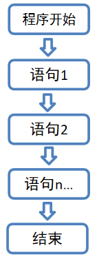
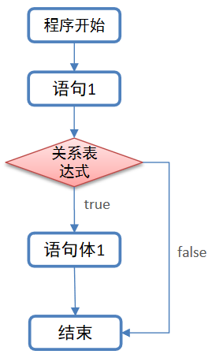
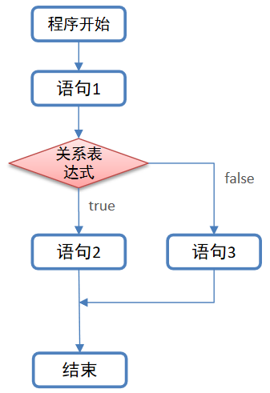
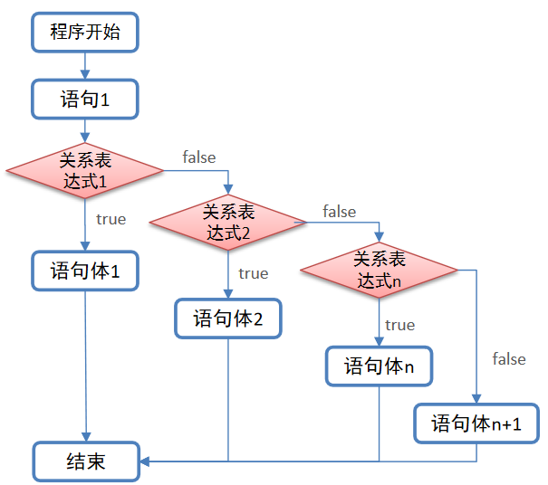

# Scala第四章节

### 章节目标

1. 掌握分支结构的格式和用法
2. 掌握for循环和while循环的格式和用法
3. 掌握控制跳转语句的用法
4. 掌握循环案例
5. 理解do.while循环的格式和用法

------

### 1. 流程控制结构

#### 1.1 概述

在实际开发中, 我们要编写成千上万行代码, 代码的顺序不同, 执行结果肯定也会受到一些影响, 并且有些代码是满足特定条件才能执行的, 有些代码是要重复执行的. 那如何合理规划这些代码呢? 这就需要用到: 流程控制结构了. 

#### 1.2 分类

 * 顺序结构

 * 选择(分支)结构

 * 循环结构

   > 注意: Scala和Java中的流程控制结构是基本一致的. 


### 2. 顺序结构

#### 2.1 概述

顺序结构是指: 程序是按照**从上至下, 从左至右的顺序, 依次逐行执行**的, 中间没有任何判断和跳转.

如图:



> 注意: 顺序结构是Scala代码的默认流程控制结构.

#### 2.2 代码演示

```Scala
val a = 10
println("a: " + a)	//打印结果为10

println("键盘敲烂, ")
println("月薪过万! ")
```

#### 2.3  思考题

下边这行代码的打印结果应该是什么呢?

```scala
println(10 + 10 + "Hello,Scala" + 10 + 10)
20Hello,Scala1010
```

> 提示: 代码是按照从上至下, 从左至右的顺序, 依次逐行执行的.


### 3. 选择结构(if语句)

#### 3.1 概述

选择结构是指: 某些代码的执行需要依赖于特定的判断条件, 如果判断条件成立, 则代码执行, 否则, 代码不执行.

#### 3.2 分类

* 单分支
* 双分支
* 多分支

#### 3.3 单分支

所谓的单分支是指: 只有一个判断条件的if语句.

##### 3.3.1 格式 

```scala
if(关系表达式) {
    //具体的代码
}
```

> 注意: 关系表达式不管简单还是复杂, 结果必须是Boolean类型的值.

##### 3.3.2 执行流程

1. 先执行关系表达式, 看其结果是true还是false.

2. **如果是true, 则执行具体的代码**, 否则, 不执行.

3. 如图: 

   

##### 3.3.3 示例

**需求** 

​	定义一个变量记录某个学生的成绩, 如果成绩大于或者等于60分, 则打印: 分数及格.

**参考代码**

```scala
//定义变量, 记录成绩
val score = 61
//判断成绩是否不小于60分
if(score >= 60) {
    println("成绩及格")
}
```

#### 3.4 双分支

所谓的双分支是指: 只有两个判断条件的if语句.

##### 3.4.1 格式

```scala
if(关系表达式) {
    //代码1
} else {
    //代码2
}
```

##### 3.4.2 执行流程

1. 先执行关系表达式, 看其结果是true还是false.
2. 如果是true, 则执行代码1. 如果是false, 则执行代码2.
3. 如图:

    

##### 3.4.3 示例

**需求: ** 

​	定义一个变量记录某个学生的成绩, 如果成绩大于或者等于60分, 则打印: 分数及格, 否则打印分数不及格.

**参考代码**

```scala
//定义变量, 记录成绩
val score = 61
//判断成绩是否不小于60分
if(score >= 60) {
    println("成绩及格")
} else {
    println("成绩不及格")
}
```

#### 3.5 多分支

所谓的多分支是指: 有多个判断条件的if语句.

##### 3.5.1 格式

```scala
if(关系表达式1) {
    //代码1
} else if(关系表达式2) {
    //代码2
}else if(关系表达式n) {	//else if可以有多组
    //代码n
} else {
    //代码n+1			  //所有的关系表达式都不成立的时候, 执行这里的代码.
}
```

##### 3.5.2 执行流程

1. 先执行关系表达式1, 看其结果是true还是false.
2. 如果是true, 则执行代码1,  分支语句结束. 如果是false, 则执行关系表达式2, 看其结果是true还是false.
3. 如果是true, 则执行代码2.  分支语句结束. 如果是false, 则执行关系表达式3, 看其结果是true还是false.
4. 以此类推, 直到所有的关系表达式都不满足, 执行最后一个else中的代码.
5. 如图:

    

##### 3.5.3 示例

**需求: ** 

​	定义一个变量记录某个学生的成绩, 根据成绩发放对应的奖励, 奖励机制如下: 

​	[90, 100]		-> 		VR设备一套

​	[80, 90)		->		考试卷一套

​	[0, 80)		->		组合拳一套

​	其他		->		成绩无效

**参考代码**

```scala
//定义变量, 记录成绩
val score = 80
//根据成绩发放对应的奖励
if(score >= 90 && score <= 100) {
    println("VR设备一套")
} else if(score >= 80 && score < 90) {
    println("考试卷一套")
} else if(score >= 0 && score < 80) {
    println("组合拳一套")
} else {
    println("成绩无效")
}
```

#### 3.6 注意事项

if语句在使用时, 要注意的事项有以下三点: 

1. 和Java一样, 在Scala中, 如果大括号{}内的逻辑代码只有一行, 则大括号可以省略.
2. 在scala中，条件表达式也是有返回值的
3. 在scala中，没有三元表达式，可以使用if表达式替代三元表达式

**示例**

定义一个变量sex，再定义一个result变量，如果sex等于"male"，result等于1，否则result等于0

**参考代码**

```scala
//定义变量, 表示性别
val sex = "male"
//定义变量, 记录if语句的返回值结果
val result = if(sex == "male") 1 else 0
//打印结果为 result: 1
println("result: " + result)
```

#### 3.7 嵌套分支

有些时候, 我们会涉及到"组合判断", 即一个分支结构中又嵌套了另一个分支结构, 这种写法就叫嵌套分支. 里边的那个分支结构叫: 内层分支, 外边的那个分支结构叫: 外层分支.

**示例**

定义三个变量a,b,c, 初始化值分别为: 10, 20, 30, 通过if分支语句, 获取其中的最大值.

**思路分析**

1. 定义三个变量a, b, c, 分别记录要进行操作的值.
2. 定义变量max, 用来记录获取到的最大值.
3. 先判断a是否大于或者等于b.
4. 条件成立, 说明 a大(或者等于b), 接着比较a和c的值, 获取最大值, 并将结果赋值给变量max
5. 条件不成立, 说明 b大, 接着比较b和c的值, 获取最大值, 并将结果赋值给变量max
6. 此时, max记录的就是a, b, c这三个变量的最大值, 打印即可.

**参考代码**

```scala
//1. 定义三个变量a, b, c, 分别记录要进行操作的值.
val a = 10
val b = 20
val c = 30
//2. 定义变量max, 用来记录获取到的最大值.
var max = 0
//3. 先判断a是否大于或者等于b.
if(a >= b) {
    //4. 走这里说明a大(或者等于b), 接着比较a和c的值
    max = if(a >= c) a else c
} else {
    //5.  走这里说明b大, 接着比较b和c的值
    max = if(b >= c) b else c
}
//6. 打印max的值
println("max: " + max)
```

> 注意: 嵌套一般不超过3层. 

#### 3.8 扩展: 块表达式

- scala中，使用{}表示一个块表达式
- 和if表达式一样，块表达式也是有值的
- 值就是最后一个表达式的值

**问题**

请问以下代码，变量a的值是什么？

```scala
val a = {
   println("1 + 1")
   1 + 1
}
println("a: " + a)
a: 2
```

### 4. 循环结构

#### 4.1 概述

循环，指的是事物周而复始的变化。而Scala中的循环结构，是指: 使一部分代码按照次数或一定的条件反复执行的一种代码结构。例如: 打印10次"Hello, Scala!", 如果纯写输出语句, 需要写10次, 而通过循环来实现的话, 输出语句只需要写1次, 这样就变得很简单了. 

#### 4.2 分类

* for循环
* while循环
* do.while循环

> 注意: 这三种循环推荐使用for循环, 因为它的语法更简洁, 更优雅.

#### 4.3 for循环

在Scala中, for的格式和用法和Java中有些差异, Scala中的for表达式功能更加强大.

##### 4.3.1 格式

```scala
for(i <- 表达式/数组/集合) {
    //逻辑代码
}
```

> 注意: 执行流程和Java一致

##### 4.3.2 简单循环

**需求: **

​	打印10次"Hello, Scala!"

**参考代码: **

```scala
//定义一个变量, 记录1到10的数字
val nums = 1 to 10	//to是Scala中的一个关键字
//通过for循环, 打印指定的内容
for(i <- nums) {
     println("Hello, Scala! " + i)
}
```

**上述代码可以简写成: **

```Scala
for(i <- 1 to 10) println("Hello, Scala! " + i)
```

##### 4.3.3 嵌套循环

**需求: **使用for表达式，打印以下字符, 每次只能输出一个"*"

```scala
*****
*****
*****
```

**步骤**

1. 使用for表达式打印3行，5列星星
2. 每打印5个星星，换行

**参考代码**

```scala
//写法一: 普通写法
for(i <- 1 to 3) {		//外循环控制行数
    for(j <- 1 to 5) {	//内循环控制列数
        print("*")		//每次打印一个*
    }
    println()			//打印完一行(5个*)之后, 记得换行
}

//写法二: 压缩版
for(i <- 1 to 3) {		
    //这是两行代码
    for(j <- 1 to 5) if(j == 5) println("*") else print("*")
}

//写法三: 合并版（只有第5，10，15需要改行）
for(i <- 1 to 3; j <- 1 to 5) if(j == 5) println("*") else print("*")
```

##### 4.3.4 守卫

for表达式中，可以添加if判断语句，这个if判断就称之为守卫。我们可以使用守卫让for表达式更简洁。

**语法**

```scala
for(i <- 表达式/数组/集合 if 表达式) {
    //逻辑代码
}
```

**示例**

使用for表达式打印1-10之间能够整除3的数字

**参考代码**

```scala
// 添加守卫，打印能够整除3的数字
for(i <- 1 to 10 if i % 3 == 0) println(i)
```

##### 4.4.5 for推导式

Scala中的for循环也是有返回值的, 在for循环体中，可以使用yield表达式构建出一个集合(可以简单理解为: 就是一组数据)，我们把使用yield的for表达式称之为**推导式.**

**示例**

生成一个10、20、30...100的集合

**参考代码**

```scala
// for推导式：for表达式中以yield开始，该for表达式会构建出一个集合
val v = for(i <- 1 to 10) yield i * 10
println(v)
```

#### 4.4 while循环

scala中while循环和Java中是一致的, 所以学起来非常简单.

##### 4.4.1 格式

```scala
初始化条件
while(判断条件) {
    //循环体
    //控制条件
}
```

##### 4.4.2 执行流程

1. 执行初始化条件.
2. 执行判断条件, 看其结果是true还是false.
3. 如果是false则循环结束.
4. 如果是true则执行循环体.
5. 执行控制条件.
6. 返回第二步, 重复执行.

##### 4.4.3 示例

**需求: **

​	打印1-10的数字

**参考代码**

```scala
//初始化条件
var i = 1
//判断条件
while(i <= 10) {
    //循环体
    println(i)
    //控制条件
    i = i + 1
}
```

#### 4.5 do.while循环

scala中do.while循环和Java中是一致的, 所以学起来非常简单.

##### 4.4.1 格式

```scala
初始化条件
do{
    //循环体
    //控制条件
}while(判断条件) 
```

##### 4.4.2 执行流程

1. 执行初始化条件.
2. 执行循环体.
3. 执行控制条件.
4. 执行判断条件, 看其结果是true还是false.
5. 如果是false则循环结束.
6. 如果是true则返回第2步继续执行.

> 注意:  
>
>  	1. do.while循环不管判断条件是否成立, 循环体都会执行一次.
>  	2. for循环, while循环都是如果判断条件不成立, 则循环体不执行.

##### 4.4.3 示例

**需求: **

​	打印1-10的数字

**参考代码**

```scala
//初始化条件
var i = 1
do{
    //循环体
    println(i)
    //控制条件
    i = i + 1
}while(i <= 10)	//判断条件
```

#### 4.6 break和continue

- 在scala中，类似Java和C++的break/continue关键字被移除了
- 如果一定要使用break/continue，就需要使用scala.util.control包下的Breaks类的**breable**和**break**方法。

##### 4.6.1 实现break

**用法**

1. 导包.

   > `import scala.util.control.Breaks._`

2. 使用breakable将for表达式包起来

3. for表达式中需要退出循环的地方，添加`break()`方法调用

**示例**

使用for表达式打印1-10的数字，如果遇到数字5，则退出for表达式

**参考代码**

```scala
// 导入scala.util.control包下的Break
import scala.util.control.Breaks._

breakable{
    for(i <- 1 to 10) {
        if(i == 5) break() else println(i)
    }
}
```

##### 4.6.2 实现continue

**用法**

continue的实现与break类似，但有一点不同：

> 注意:
>
> 1. 实现break是用breakable{}将整个for表达式包起来.
> 2. 而实现continue是用breakable{}将for表达式的循环体包含起来就可以了.
>   也就是通过break把语句重新导回到for文的开始

**示例**

用for表达式打印1~100之间, 所有不能整除3的数字.

```scala
// 导入scala.util.control包下的Break    
import scala.util.control.Breaks._

for(i <- 1 to 100 ) {
    breakable{
        if(i % 3 == 0) break()
        else println(i)
    }
}
```


### 5. 综合案例

#### 5.1 九九乘法表

**需求: **

打印九九乘法表

**步骤**

1. 通过外循环控制打印的行数.

2. 通过内循环控制每行打印的列数. 

   > 注意:  因为列数是随着行数递增的, 即: 
   >
   > | 行数 | 该行的总列数 |
   > | :--: | :----------: |
   > |  1   |      1       |
   > |  2   |      2       |
   > |  3   |      3       |
   > |  n   |      n       |
   >
   > 结论: 如果用**i**表示行数, 那么该行的列数取值范围为: [1, i]

**参考代码**

* **方式一: 普通写法**

```scala
//外循环控制行
for(i <- 1 to 9) {		
    //内循环控制列
    for(j <- 1 to i) {
        print(s"${i} * ${j} = ${i * j}\t")
    }
    println()			//别忘了换行
}
```

* **方式二: 合并版写法**

```scala
//外循环控制行
for(i <- 1 to 9; j <- 1 to i) {		
    print(s"${i} * ${j} = ${i * j}\t")
    if(j == i) println()	//别忘了换行
}
```

#### 5.2 模拟登陆

**需求: **

老王要登陆黑马官网学习Scala,  假设老王的账号和密码分别为"itcast", "heima", 且同一账号只有3次登陆机会, 如果3次都录入错误, 则提示账号被锁定. 请用所学模拟该场景.

**步骤**

1. 导包
   * scala.io.StdIn
   * scala.util.control.Breaks._
2.  定义变量, 记录用户录入的账号和密码.
3. 因为涉及到break的动作, 所以要用breakable{}把整个for表达式包裹起来
4. 因为只有3次登陆机会, 所以推荐使用for循环.
5. 提示用户录入他/她的账号和密码, 并接收.
6. 判断用户录入的账号和密码是否正确.
7. 如果录入正确, 则提示"登陆成功, 开始学习Scala!", 循环结束.
8. 如果录入错误, 则判断是否还有登陆机会
   * 有, 则提示"用户名或者密码错误, 您还有*次机会", 然后返回第5步继续执行.
   * 没有, 则提示"账号被锁定, 请与管理员联系", 循环结束.

**参考代码**

```Scala
//1. 导包
import scala.io.StdIn
import scala.util.control.Breaks._

//2. 定义变量, 记录用户录入的账号和密码
var username = ""
var password = ""
//3. 因为涉及到break的动作, 所以要用breakable{}把整个for表达式包裹起来
breakable {
 	//4. 因为只有3次登陆机会, 所以推荐使用for循环.
    for(i <- 1 to 3) {
        //5. 提示用户录入他/她的账号和密码, 并接收.
        println("请录入您的账号: ")
        username = StdIn.readLine()
        println("请录入您的密码: ")
        password = StdIn.readLine()
        //6. 判断用户录入的账号和密码是否正确.
        if(username == "itcast" && password == "heima") {
            //7. 走到这里, 说明登陆成功, 循环结束.
            println("登陆成功, 开始学习Scala吧!")
            break()
        } else {
            //8. 走到这里, 说明登陆失败. 则判断是否还有登陆机会
            if(i == 3) println("账号被锁定, 请与管理员联系!") 
            else println(s"用户名或者密码错误, 您还有${3 - i}次机会")
        }
    }  
}
```

